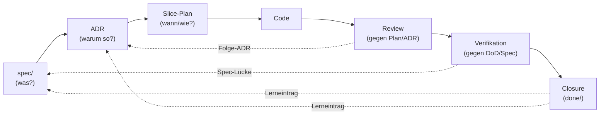

## Modul 1 — Der Entwicklungszyklus

*Quelle: [01-spec-und-architektur/modul-01-entwicklungszyklus.md](https://github.com/pt9912/ai-harness-course/blob/v1.4.0/kurs/de/01-spec-und-architektur/modul-01-entwicklungszyklus.md)*

### Lebenszyklus als Diagramm



Die durchgezogenen Pfeile sind der *Vorwärtspfad* (was wird gebaut), die
gestrichelten der *Rückwärtspfad* (was lernt der Harness daraus). Beide
Richtungen sind Pflicht — eine Kette ohne Rückverweise ist nicht
auditierbar.

Review prüft Code gegen *Plan und ADR*.
Wenn der Plan die ADR-Verletzung nicht antizipiert hat, sieht Review
sie nicht. Verifikation prüft Code gegen *DoD und Spec* (und dort
referenzierte ADRs). Das ist genau der Grund, warum Review und
Verifikation getrennte Rollen sind — siehe [Modul 8](https://github.com/pt9912/ai-harness-course/blob/v1.4.0/kurs/de/03-agenten/modul-08-agentenrollen.md).

### Kernidee (Modul 1)

Jedes Artefakt verweist nach oben (Begründung) und nach unten
(Konsequenz). Eine Kette ohne Rückverweise ist nicht auditierbar.

### Regeln gegen typische Fehlannahmen (Modul 1)

- Plan ist die Stelle, an der Spec und ADR auf einen Code-Diff zusammenfallen. Ohne Bezugs-IDs zu Spec/ADR ist der Plan nicht prüfbar (und damit kein Plan, sondern eine Liste).
- Closure verlangt einen Lerneintrag im Slice. Ohne Lerneintrag wird die Welle nicht "fertig", sondern nur "weg".
- Wer das erste Mal ein Konflikt zwischen AGENTS.md und Spec hat und dann erst überlegt, hat den Konflikt bereits in den Code laufen lassen.

### Worked Example: einen Source-Precedence-Block aus einem konfliktbehafteten Repo destillieren

**Schritt 0 — Baseline und Modus festlegen.** Vor dem Sammeln
kanonischer Quellen muss klar sein: *welche Harnesskonvention* adoptiert
wird (AI-Harness-Kurs, interner Standard, Industrie-Norm), *welche
Repo-Klasse* angesetzt wird (Referenz, Safety/Control, Policy/Compliance,
Tooling) und *welcher Modus pro Sub-Area* gilt (Greenfield: Doc führt,
Code folgt; Brownfield: Code führt, Doku folgt — mit Konvergenz-Auftrag
zu Greenfield). Diese drei Entscheidungen prägen jede Folge-Aktion: in
Brownfield ist der nächste Schritt *Inventur des Bestands*, in Greenfield
*Auflisten zu schaffender Quellen*. Volldefinitionen und Phasen-Modell
in [`grundlagen/konventionen.md` §Harness-Bootstrap](https://github.com/pt9912/ai-harness-course/blob/v1.4.0/kurs/de/grundlagen/konventionen.md#harness-bootstrap)
(Konzept-Anker) und im ausgearbeiteten
[Modul 2 — Harness-Bootstrap](https://github.com/pt9912/ai-harness-course/blob/v1.4.0/kurs/de/01-spec-und-architektur/modul-02-harness-bootstrap.md) (Lehrtext
mit GF/BF-Walkthroughs).
Die folgenden sechs Schritte 1–6 beschreiben den Greenfield-Pfad; in
Brownfield-Modus läuft jeder Schritt als Code → Doc-Inventur mit
parallelem Diskrepanz-Backlog (siehe
[`grundlagen/fallstudien.md` §Beobachtung aus dem Ist-Zustand](https://github.com/pt9912/ai-harness-course/blob/v1.4.0/kurs/de/grundlagen/fallstudien.md#beobachtung-aus-dem-ist-zustand)).

**Schritt 1 — Kanonische Quellen sammeln, Mehrfach-Quellen erkennen.**
Liste alle Dokumente, die *normativ* etwas behaupten ("so soll es
sein"). Marketing-Texte, Tutorials, externe Wiki-Seiten gehören nicht
dazu. Ergebnis-Form: eine flache Liste *vor* der Ranking-Diskussion.

```
spec/lastenheft.md
spec/spezifikation.md            (existiert noch nicht — anlegen?)
spec/architecture.md             (Umbenennung von docs/architecture.md)
docs/plan/adr/*.md
docs/plan/planning/in-progress/roadmap.md
docs/user/operations.md          (existiert noch nicht — verschieben?)
README.md
AGENTS.md
harness/README.md                (neue Datei dieses Moduls)
```

Beobachtung: zwei Lücken (`spezifikation.md`, `docs/user/*`) und eine
Umbenennung (`docs/architecture.md` → `spec/architecture.md`) tauchen
*durch* das Listing auf. Das ist kein Nebenprodukt — das ist die
Hauptwirkung von Schritt 1.

**Schritt 2 — Rangkriterien festlegen, nicht erfinden.** Die Reihenfolge
ist nicht Geschmacksfrage; sie folgt zwei Achsen:

1. **Vertragliche Bindung absteigend.** Lastenheft (Abnahme-bindend) →
   Spezifikation (technisch fortschreibbar) → Architektur (Konstanten
   der Lösung) → ADRs (Einzelentscheidungen) → Roadmap (aktuelle Welle)
   → Operativ-Doku → Allgemein-Doku.
2. **Schreib-Frequenz absteigend.** Lastenheft wird selten geändert
   (jedes Update ist Spec-Disziplin). `AGENTS.md` wird oft angepasst.
   Wer die Reihenfolge umdreht, lässt die Agent-Briefing-Datei
   stillschweigend die Spec überschreiben — exakt die Drift, gegen die
   Source Precedence erfunden wurde.

Die `harness/README.md` selbst rangiert *unten*: sie ist ein
Einstiegspunkt, keine neue Quelle.

**Schritt 3 — Tabelle entwerfen.** In `harness/README.md`:

```markdown
## Source precedence

| Rang | Datei | Charakter |
|---|---|---|
| 1 | [`spec/lastenheft.md`](../spec/lastenheft.md) | vertraglich abnahmebindend |
| 2 | [`spec/spezifikation.md`](../spec/spezifikation.md) | technisch fortschreibbar |
| 3 | [`spec/architecture.md`](../spec/architecture.md) | Komponenten/Sequenzen, meilensteinfrei |
| 4 | [`docs/plan/adr/`](../docs/plan/adr/) | Architekturentscheidungen |
| 5 | [`docs/plan/planning/in-progress/roadmap.md`](../docs/plan/planning/in-progress/roadmap.md) | aktuelle Welle |
| 6 | [`docs/user/*`](../docs/user/) | Operations, Quality, Releasing |
| 7 | [`README.md`](../README.md) | Projekt-Überblick |
| 8 | [`AGENTS.md`](../AGENTS.md) | Agent-Briefing |
| 9 | diese Datei | Harness-Einstieg |
```

Vorlage:
[`/lab/templates/harness/README.template.md`](https://github.com/pt9912/ai-harness-course/blob/v1.4.0/lab/templates/harness/README.template.md).
Neun Ränge sind ein Maximum — wer mehr braucht, hat
Mehrfach-Repräsentationen, die in den Schichten 1–3 gebündelt werden
sollten. Die konkrete Rangordnung selbst ist projektspezifisch
(Safety/Control- und Policy/Compliance-Repos können abweichen); Wahl
und Begründung gehören in den Adaptions-Block des repo-lokalen
Konventionsdokuments (siehe
[`grundlagen/konventionen.md#source-precedence`](https://github.com/pt9912/ai-harness-course/blob/v1.4.0/kurs/de/grundlagen/konventionen.md#source-precedence)).

**Schritt 4 — Konfliktauflösungs-Klausel daneben setzen.** Eine
Tabelle allein wirkt nicht; sie braucht den Satz, der ihre Anwendung
*erzwingt*:

```markdown
Wenn diese Datei einer kanonischen Quelle widerspricht, **gewinnt die
kanonische Quelle**, und diese Datei wird angepasst.
```

Derselbe Satz gehört spiegelbildlich in `AGENTS.md` (mit
"AGENTS.md" statt "diese Datei"). Damit hat jeder Implementer und jeder
Agent ein eindeutiges Verfahren: bei Konflikt → höher rangierende
Quelle, niedriger rangierende anpassen.

**Schritt 5 — Bezug zur Spec-Stratifizierung herstellen.** Die drei
Spec-Ebenen (Lastenheft / Spezifikation / Architektur) haben *intern*
ebenfalls eine Precedence: das Lastenheft schärft die Spezifikation,
die Spezifikation schärft die Architektur — niemals andersherum. Diese
Regel kommt als Kurzhinweis in den Block, weil sie sonst beim ersten
Konflikt verloren geht:

```markdown
**Spec-Stratifizierung.** Innerhalb der Spec gilt: Lastenheft (1) →
Spezifikation (2) → Architektur (3). Eine ADR darf die Spezifikation
schärfen, niemals das Lastenheft. Wer das Lastenheft per ADR ändern
will, ändert in Wahrheit die Spec — und das ist ein eigener Slice.
```

Volldefinition siehe
[`grundlagen/konventionen.md`](https://github.com/pt9912/ai-harness-course/blob/v1.4.0/kurs/de/grundlagen/konventionen.md#source-precedence).

**Schritt 6 — Bewusstes Brechen: einen Konflikt provozieren.** Ändere
in `AGENTS.md` eine Hard Rule, die einer ADR widerspricht (z. B.
"Direkt-DB-Zugriff erlaubt", obwohl ADR-0001 hexagonale Architektur
festschreibt). Beobachte:

| Beobachtung | Diagnose |
|---|---|
| Implementer fragt nicht nach, schreibt Code gegen AGENTS.md | Source Precedence ist nicht *durchgesetzt* — Konfliktauflösungs-Klausel fehlt im AGENTS.md-Header. |
| Implementer stoppt, weist auf Konflikt hin | Source Precedence wirkt — der Konflikt wird sichtbar, bevor er Code wird. |
| Implementer ändert die ADR | Falsche Auflösungsrichtung: ADRs sind Rang 4, AGENTS.md Rang 8 — die niedrigere Quelle muss angepasst werden. |

Sechs Schritte, ein Block in `harness/README.md`, eine Konfliktauflösung
mit Spiegelung in `AGENTS.md`. Der Test, ob er funktioniert, ist der
nächste Konflikt — nicht der nächste Lesedurchgang.

