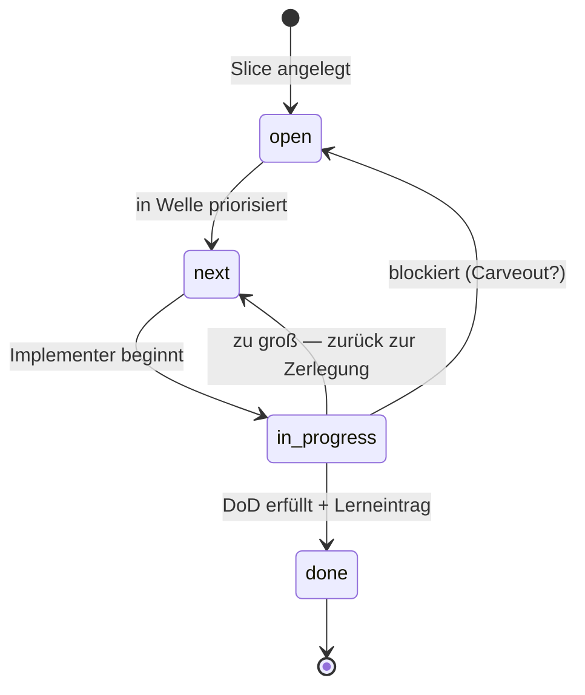

## Modul 5 — Planning Harness

*Quelle: [02-planung/modul-05-planning-harness.md](https://github.com/pt9912/ai-harness-course/blob/v1.4.0/kurs/de/02-planung/modul-05-planning-harness.md)*

### Kernidee (Modul 5)

Ein Slice ist klein, wenn ein Agent ihn in *einem* Lauf abschließen kann
und ein Reviewer den Diff *in einer Sitzung* prüfen kann. Größer ist
falsch.

### Lifecycle als State Machine



Drei Übergänge sind nichttrivial: `in_progress → next` (Rückführung bei
Größen-Erkenntnis) und `in_progress → open` (Blocker — meist mit
Carveout, siehe [Modul 7](https://github.com/pt9912/ai-harness-course/blob/v1.4.0/kurs/de/02-planung/modul-07-carveouts.md)). Der einzige Übergang
nach `done` verlangt *Lerneintrag*, nicht nur "Tests grün".

### Trigger je Lifecycle-Übergang und WIP-Limit (Modul 5)

Alle fünf Übergänge mit Triggerbedingung:

- `open→next` — priorisiert/eingeplant.
- `next→in-progress` — Implementer übernimmt, Abhängigkeiten gelöst, WIP-Limit frei.
- `in-progress→done` — Closure-Kriterien erfüllt.
- `in-progress→next` — Slice zu groß, zurück zum Schneiden.
- `in-progress→open` — Blocker, Priorität offen.

Am leichtesten übersehen werden die *Rückführungen* — `in-progress→next`
und `in-progress→open` —, weil sie wie "Scheitern" aussehen, in Wahrheit
aber die Lifecycle-Disziplin tragen: ein Slice, der zu groß war, gehört
sichtbar zurück, nicht still weitergeschoben.

WIP-Limit pro Implementer = 1 ist eine harte Größe, kein Vorschlag — wer
mehrere Slices gleichzeitig in `in-progress/` hat, hat keine Lifecycle,
sondern ein Buffet.

### Closure- und Lerneintrag-Regeln (Modul 5)

- Übergang nach `done/` verlangt zwei beobachtbare Closure-Kriterien
  (z. B. Replay grün, DoD-Punkte als Test verlinkt) *und* einen
  Lerneintrag in einer der drei Formen (geschärfte Regel · neuer Sensor ·
  benannte Spec-Lücke).
- Der Lerneintrag schließt den Steering Loop — ohne ihn bleibt das
  Versagensmuster unsichtbar und wiederholt sich.
- Ein Slice darf bei rotem Gate nur mit dokumentiertem Carveout
  (Modul 7) in `done/` landen, der den roten Gate-Status auf Trigger
  schaltet. Unterscheidung: Carveout (Ausnahme, mit Folge-Slice) vs.
  bootstrap-aware Gate (Stufung, mit Hochschalt-Trigger, Modul 13). Die
  volle Werkzeug-Triade inkl. *BF-Sub-Area-Markierung* (Sub-Area-Kontext,
  kein Closure-Werkzeug) wird in
  [Modul 7 §Worked Example A Schritt 6](modul-07-carveouts.md#worked-example-a-einen-carveout-dokumentieren)
  disambiguiert.

### Worked Example: einen zu großen Slice schneiden

**Ausgangs-Slice:** `SL-014 — Authentifizierung implementieren`. DoD:
"Login funktioniert, JWT wird ausgegeben, Refresh-Token-Flow läuft,
Token-Revocation per Admin-Endpoint, Audit-Log auf Login-Versuche."

**Diagnose:** zu groß. Anzeichen:
1. Mehr als drei DoD-Punkte (Faustregel).
2. Mehrere Schichten betroffen (Adapter + Service + UI + DB-Schema).
3. Kann nicht in einer Review-Sitzung geprüft werden.

**Schnitt nach Schichten oder nach Lieferwert?** Lieferwert. Schnitte
nach Schichten führen oft zu Zombie-Slices, die "fast fertig" sind.

**Schnitt-Vorschlag (drei Slices):**

| ID | DoD | Liefert |
|---|---|---|
| `SL-014a` | Login-Endpoint akzeptiert User/Passwort, gibt JWT zurück, Audit-Log-Eintrag entsteht. | Funktion |
| `SL-014b` | Refresh-Token-Flow gegen JWT, mit Ablauf-Tests. | Sicherheit |
| `SL-014c` | Admin-Endpoint zur Token-Revocation, mit Architekturtest gegen Direkt-DB-Zugriff. | Operativität |

**Begründung:** Jeder Schnitt-Slice ist einzeln lieferbar (kein Slice
wartet auf den nächsten). Jeder hat ≤3 DoD-Punkte. Jeder berührt
höchstens zwei Schichten.

**Was *nicht* geht:** "Schicht-Slice" wie `SL-014-db`, `SL-014-service`,
`SL-014-ui` — diese sind voneinander abhängig und einzeln nutzlos. Sie
landen mit hoher Wahrscheinlichkeit als Zombie in `in-progress/`.

### Worked Mini-Example: Bootstrap-Modus pro Sub-Area für einen Slice begründen

**Beispiel-Slice:** `SL-014a` aus dem Worked Example oben. Spec-Anker
und ADR werden in [Modul 9 §Worked Example](https://github.com/pt9912/ai-harness-course/blob/v1.4.0/kurs/de/03-agenten/modul-09-implementierung.md#worked-example-ein-slice-durch-den-8-schritt-workflow)
mit `LH-FA-AUTH-001` und `ADR-0007` (Service-Adapter-Layer)
konkretisiert; wir nutzen dieselben IDs hier konsistent.

**Berührte Sub-Areas:** vier
Sub-Areas — *Konventionen* (API-Pattern), *Test-Infrastruktur*,
*Audit-Logging* und *Spec-Schreibung* (Authentifizierungs-Anforderung).
Die DoD verlangt jede einzelne (Login-Endpoint → API-Pattern;
Login-Tests → Test-Infrastruktur; Audit-Log-Eintrag → Audit-Logging;
`LH-FA-AUTH-001`/`ADR-0007` → Spec-Schreibung).

**Pflichtkriterien** (vier, nicht erweitern):

1. **Konventionen-Dichte** — wieviel der berührten Doku-/Code-Sektion ist
   durch `harness/conventions.md` (oder ein gleichwertiges Artefakt) als
   Strukturregel verankert?
2. **Phase-Reife der berührten Artefakt-Sektionen** — Phase 0–5 aus der
   Phase × Modus-Matrix in [Modul 2](https://github.com/pt9912/ai-harness-course/blob/v1.4.0/kurs/de/01-spec-und-architektur/modul-02-harness-bootstrap.md#phasen--modus--die-zweidimensionale-reife-matrix).
3. **Evidenz- und Diskrepanz-Risiko** — wie groß ist die Gefahr, dass
   Inventur den Code-Bestand und die Doku-Aussage als divergent
   ausweist? Bei GF meist niedrig (Doc führt — Inventur prüft nur
   Code-Konformität); bei BF/Hybrid das Hauptrisiko und der Grund, warum
   das Kriterium dort die Reconciliation-Schätzung trägt.
4. **Reconciliation-Aufwand inklusive Graduation-/Folge-Slice-Trigger** —
   wieviel Slice-Aufwand bringt BF/Hybrid mit sich, und welcher Trigger
   (eine der vier Klassen aus
   [`konventionen.md` §Vier Trigger-Klassen](https://github.com/pt9912/ai-harness-course/blob/v1.4.0/kurs/de/grundlagen/konventionen.md#vier-trigger-klassen)
   — Sync, Promotion, Cross-Reference, Acceptance — oder eine
   Folge-Slice-ID) schaltet die Sub-Area Richtung GF?

**Sub-Area 1 — Konventionen (GF):**

- *Konventionen-Dichte:* hoch. `harness/conventions.md` führt `MR-014`
  *REST-Endpunkt-Pattern* mit URL-Struktur, Status-Code-Regeln und einer
  Negativ-Bedingung gegen Direkt-DB-Zugriffe aus dem Adapter.
- *Phase-Reife:* Phase 4. Konvention steht, Code wird daran gemessen,
  Reviews zitieren `MR-014`.
- *Evidenz-/Diskrepanz-Risiko:* niedrig. Das `make lint-conventions`-
  Target prüft die Pattern-Konformität automatisch und ist als Sensor
  in `harness/README.md` §Sensors gelistet (Sensor-Zeile zitiert
  `MR-014`).
- *Reconciliation-Aufwand:* keiner. Kein Folge-Slice.
- **Modus: GF.**

**Sub-Area 2 — Test-Infrastruktur (BF):**

- *Konventionen-Dichte:* niedrig. `tests/auth/` zeigt zwei abweichende
  Pfadnaming-Schemata (`test_*.py` vs. `*_test.py`); keines steht in
  `harness/conventions.md`.
- *Phase-Reife:* Phase 1 BF — Skelett-Sektion *Test-Layout* in
  `harness/conventions.md` ist mit Inventur-Auftrag kopiert (leere
  Pflicht-Felder), der Code-Bestand in `tests/auth/` füllt sie noch
  nicht (Matrix: *"Template kopiert, Inventur-Auftrag an Code"*).
- *Evidenz-/Diskrepanz-Risiko:* mittel. Inventur kann sichtbar machen,
  dass die bestehenden Tests an die Authentifizierungs-Schicht andere
  Annahmen tragen als die noch zu schreibenden — z. B. ob Mocking auf
  Adapter- oder Service-Ebene zulässig ist.
- *Reconciliation-Aufwand:* 1 Slice (`SL-RC-014t` Inventur + `MR-002`
  *Test-Layout pro Sub-Schicht* in `harness/conventions.md` ergänzen).
  Graduation-Trigger: **Sync-Trigger** setzt `MR-002` in
  `harness/README.md` und `AGENTS.md` als Quelle für künftige
  Test-Konventionen.
- **Modus: BF.**

**Sub-Area 3 — Audit-Logging (Hybrid):**

- *Konventionen-Dichte:* mittel. `harness/conventions.md` führt im
  Adaptions-Block `MR-008` *Audit-Log-Pflicht für Auth-Endpunkte* als
  abstrakte Pflicht-Adaption ("jeder Login-Versuch muss ein
  Audit-Event erzeugen"), aber kein konkretes Event-Schema. Code in
  `services/audit/` zeigt zwei unterschiedliche Event-Formate aus
  früheren Slices.
- *Phase-Reife:* Phase 3 (GF-Lesart aus der Matrix: *"Sektionen
  versprochen, Code folgt"* — die Doku verspricht eine Audit-Pflicht,
  der Code folgt erst teilweise). Die Hybrid-Diagnose entsteht **nicht
  aus der Phase**, sondern beim Modus: die Doku führt für die
  Pflicht-Aussage (GF-Richtung), aber für den Format-Standard zeigt
  der Code-Bestand Divergenz ohne Doku-Korrespondenz (BF-Symptom).
  Phase und Modus sind orthogonal — eine Sub-Area sitzt in genau
  einer Phase-Zelle, der Modus ergibt sich aus der Trigger-Richtung
  pro Kriterium.
- **Modus: Hybrid (GF in der Pflicht-Adaption `MR-008`, BF im
  fehlenden Format-Standard).**

**Sub-Area 4 — Spec-Schreibung (GF):**
`spec/lastenheft.md` §`LH-FA-AUTH-001` trägt drei Akzeptanzkriterien;
`ADR-0007` *Service-Adapter-Layer* bindet die Architektur; in Modul 9
§Worked Example werden Tests gegen `LH-FA-AUTH-001` annotiert. Damit
sind Konventionen-Dichte hoch, Phase 4, Risiko niedrig, kein
Reconciliation — **Modus: GF.**

**Template für den Begründungsblock** — kanonisch in
[§8 Sub-Area-Modus-Begründung](https://github.com/pt9912/ai-harness-course/blob/v1.4.0/lab/templates/docs/plan/planning/slice.template.md)
des Slice-Plan-Templates; hier zum Lesen abgedruckt, **byte-identisch
mit dem dortigen Format**, damit Kopieren von hier oder vom Template
denselben Block ergibt:

```markdown
### Sub-Area: <Name>

- **Modus:** GF | BF | Hybrid
- **Konventionen-Dichte:** <Beleg aus `harness/conventions.md`,
  Adaptions-Block oder Code>
- **Phase-Reife:** Phase 0–5 <Begründung gegen die Phase × Modus-Matrix>
- **Evidenz-/Diskrepanz-Risiko:** <bei BF/Hybrid: was kann die
  Inventur sichtbar machen? bei GF: meist niedrig>
- **Reconciliation-Aufwand:** <Slice-Schätzung;
  Graduation-/Folge-Slice-Trigger>
```

Pro berührter Sub-Area einen Block in §8 des Slice-Plans. So läuft die
Modus-Entscheidung im Planning-Harness-Slice mit und wird in der
Closure-Notiz prüfbar.

### Regeln gegen typische Fehlannahmen (Modul 5)

- **Gegen "Slice = Ticket = Feature":** Drei verschiedene Granularitäten. Feature ist Spec-Ebene, Slice ist Implementations-Einheit, Ticket ist Projektmanagement. Slice ist die kleinste *agentisch abschließbare* Einheit.
- **Gegen "Erst plan ich alle Slices, dann fange ich an":** Wer alle Slices vor der ersten Implementation plant, plant tote Slices. Plan und Implementation alternieren — Welle für Welle.
- **Gegen "Wenn ein Slice in `done/` ist, ist er fertig":** Ohne Lerneintrag ist er nur *abgelegt*. Closure ist eine bewusste Reflexionsleistung: was hat funktioniert, was war Friktion, was geht in den Steering Loop?
- **Gegen "Ein Slice hat einen Bootstrap-Modus":** Der Modus ist Eigenschaft *pro Sub-Area* ([Modul 2 §Kernidee](https://github.com/pt9912/ai-harness-course/blob/v1.4.0/kurs/de/01-spec-und-architektur/modul-02-harness-bootstrap.md#kernidee)). Ein Slice berührt mehrere Sub-Areas und kann GF, BF und Hybrid gleichzeitig involvieren.
- **Gegen "Wenn der Slice klein ist, ist die berührte Sub-Area GF":** Transitive Vereinfachung. Slice-Größe und Sub-Area-Modus sind orthogonale Achsen: Slice-Größe misst, ob der Schnitt in einer Review-Sitzung prüfbar ist; Sub-Area-Modus misst den Reifegrad der berührten Doku-/Code-Sektion. Ein kleiner Slice kann eine BF-Sub-Area berühren (Beispiel: Login-Endpoint ist klein, aber das Test-Layout für die Auth-Schicht ist nicht in `harness/conventions.md` verankert).

