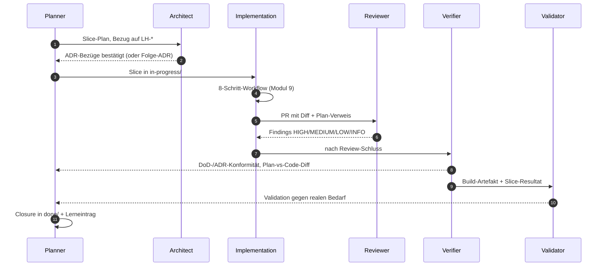
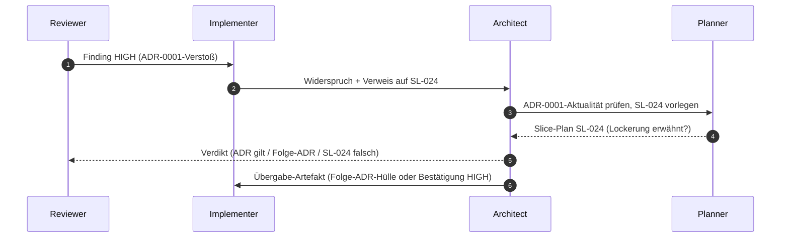

## Modul 8 — Agentenrollen

*Quelle: [03-agenten/modul-08-agentenrollen.md](https://github.com/pt9912/ai-harness-course/blob/v1.4.0/kurs/de/03-agenten/modul-08-agentenrollen.md)*

### Kernidee (Modul 8)

Rollentrennung verhindert, dass derselbe Kontext zweimal denselben Fehler
macht. Wer geplant hat, prüft nicht; wer geschrieben hat, reviewt nicht.

### Rollen-Sequenz für einen Slice

Wesentlich: keine Rolle springt rückwärts in eine vorhergehende, ohne
*Übergabe-Artefakt* (Findings, Folge-ADR-Vorschlag, Carveout). Der
Eingabe-Kontext jeder Rolle ist eingeschränkt — das verhindert, dass
dieselbe Sicht denselben Fehler übersieht.

### Die neun Übergaben und ihre Artefakte (Modul 8)

Sechs Rollen in der Reihenfolge, in der ein Slice sie typischerweise
durchläuft: Planner → Architect → Implementation → Reviewer → Verifier
→ Validator.

- Planner→Architect: Slice-Plan mit LH-Bezug
- Architect→Planner: ADR-Bezug/Folge-ADR
- Planner→Implementation: Slice in `in-progress/`
- Implementation→Reviewer: PR mit Diff + Plan-Verweis
- Reviewer→Implementation: Findings HIGH/MEDIUM/LOW/INFO
- Implementation→Verifier: DoD-Bestätigung + Sensor-Belege
- Verifier→Planner: DoD-/ADR-Konformitätsbericht + Plan-vs-Code-Diff
- Verifier→Validator: Build-Artefakt + Slice-Resultat
- Validator→Planner: Validierungsbeleg gegen realen Bedarf

Ohne *jedes* dieser Artefakte gibt es keinen Rollenwechsel — nur einen
Kontext-Switch ohne Übergabe. Ein Rollen-Sprung ohne Artefakt ist der
häufigste Pfad zu blinden Flecken.

### Rollen-Regeln (Modul 8)

- Rollen-Trennung ist Kontext-Trennung, nicht Personen-Trennung. Eine
  Person kann mehrere Rollen spielen — aber nicht im selben
  Kontextfenster, sonst wiederholen sich blinde Flecken.
- Verification: "Bauen wir es richtig?" (gegen Plan/DoD); Validation:
  "Bauen wir das Richtige?" (gegen realen Bedarf). Gefährlichster Fall:
  Verifikation grün, Validation rot — Team baut *perfekt das Falsche*.
  Umgekehrter Fall (Verifikation rot, Validation grün) ist
  Prozess-Drift, auch wenn das Ergebnis zufällig passt.
- ADR-Änderung: Architect schreibt; Reviewer prüft auf Konsistenz;
  Implementer liest als Constraint; Accepted-ADRs überschreibt
  *niemand* — Folge-ADR mit `supersedes`. Implementer darf höchstens
  Folge-ADR vorschlagen, niemals stillschweigend einer ADR
  widersprechen. Das wäre Drift, kein "pragmatisches Implementieren".
- Mehrfachzuweisung einer Tätigkeit an zwei Rollen ist *nur dann*
  sauber, wenn jede beteiligte Rolle einen *anderen Eingabe-Kontext*
  hat. Sonst ist es keine Mehrfachzuweisung, sondern doppelte Arbeit
  (und blinde Flecken).

### Worked Example: einen Konflikt-Pfad als Rollen-Sequenz mit Übergabe-Artefakten modellieren

**Ausgangs-Konflikt:** Reviewer-Agent gibt ein HIGH-Finding: *"Slice
verstößt gegen ADR-0001 (hexagonale Architektur) — Optimizer schreibt
direkt aufs Device."* Implementer-Agent widerspricht: *"ADR-0001 wurde
in der letzten Welle gelockert; ich verweise auf die Diskussion in
Slice-Plan SL-024."*

Wer entscheidet? Wer übergibt was an wen? Der naive Pfad — *"Reviewer
hat mehr Senioritätsgefühl, also Reviewer"* — wiederholt blinde Flecken
und entspricht *keiner* der sechs Rollen. Die saubere Form modelliert
den Konflikt als Sequenz mit Übergabe-Artefakten.

**Schritt 1 — Beteiligte Rollen identifizieren.** Nicht jeder Konflikt
betrifft alle sechs. Hier: *Reviewer* (hat das Finding), *Implementer*
(widerspricht), *Architect* (hütet die ADR), *Planner* (besitzt den
Slice-Plan, der angeblich die ADR lockert). Verifier und Validator
sind *nicht* beteiligt — sie kommen später, nach der Konfliktauflösung.
Wer sie früher hineinzieht, lädt blinde Flecken aus deren Kontext in
die Auflösung.

**Schritt 2 — Sequenz zeichnen.** Mermaid-Form:

Sechs Pfeile, keine Rückwärts-Schleife ohne Artefakt. Wer einen Pfeil
nicht beschriften kann, hat einen blinden Übergang — exakt die Stelle,
an der Konflikte später aufbrechen.

**Schritt 3 — Übergabe-Artefakte pro Pfeil benennen.** Sequenz wirkt
nur, wenn jeder Pfeil ein *konkretes* Artefakt trägt. Tabelle:

| Pfeil | Übergabe-Artefakt | Inhalt minimal |
|---|---|---|
| R → I | Finding HIGH | Datei:Zeile · ADR-ID · Kategorie HIGH · ein-Satz-Begründung |
| I → A | Widerspruchs-Notiz | Verweis auf Slice-Plan + behauptete Lockerung + Position des Implementers |
| A → P | ADR-Aktualitäts-Anfrage | ADR-ID · Welle, in der gelockert worden sein soll · konkrete Frage |
| P → A | Slice-Plan-Auszug | exakte Textstelle aus SL-024, die die Lockerung enthält *oder nicht enthält* |
| A → R | Verdikt | ADR-Stand bestätigt / Folge-ADR-Hülle / SL-024-Korrektur |
| A → I | Folge-Übergabe | Folge-ADR-Hülle ODER Pflicht zur Korrektur ODER Bestätigung der Lockerung mit ID |

Die zentrale Disziplin: das Verdikt von Architect nach Reviewer (Pfeil
A → R) *muss* ein Artefakt sein, das Reviewer in seine Skill-Datei
übernehmen kann. *"Mündliche Klärung"* ist keine Übergabe; sie ist
Drift mit Kaffeepause.

**Schritt 4 — Drei mögliche Verdikte mit Folge-Sequenzen.** Konflikt
hat drei Auflösungs-Klassen, jede mit eigener Folge-Sequenz. Wer das
nicht vorab durchdenkt, fällt im realen Konflikt in die bequemste —
typischerweise *"wir nehmen das mildere Finding"*, die *keine* der
drei sauberen Klassen ist:

| Verdikt | Folge-Sequenz | Übergabe-Artefakt |
|---|---|---|
| ADR-0001 gilt unverändert, SL-024 hat falsch behauptet | A → P: Slice-Plan-Korrektur; P → I: aktualisierter Plan; I implementiert ADR-konform neu | Plan-Diff mit Korrektur-Begründung |
| ADR-0001 wird per Folge-ADR `supersedes`d | A → R: Folge-ADR mit `supersedes: ADR-0001`; R aktualisiert Skill-Datei (welche Regel jetzt gilt) | Folge-ADR (Accepted) · Skill-Patch |
| Lockerung war legitim, aber nicht dokumentiert | A → P → I: Sofort-PR, der die Lockerung als Folge-ADR nachzieht; bestehender Slice darf trotzdem nicht stillschweigend abgeschlossen werden | Folge-ADR + Erinnerungs-Slice in `next/` |

*Keine* dieser Sequenzen enthält "Reviewer-Finding herabstufen, weil
Implementer widerspricht". Das wäre der vierte, *falsche* Pfad — und
er existiert nur, weil Übergabe-Artefakte fehlen.

**Schritt 5 — Sequenz auf "kein Sprung ohne Artefakt" prüfen.** Lege
die gezeichnete Sequenz aus Schritt 2 neben die Tabelle aus Schritt 3.
Für jeden Pfeil: hast du das Artefakt benennen können? Wenn ein Pfeil
übrig bleibt, ist die Sequenz *nicht* fertig — sondern dort liegt der
nächste blinde Fleck. Häufige Lücken:

- *"Reviewer → Implementer: schnelles Update im Chat"* — kein
  Artefakt, kein dokumentierbarer Übergang, kein Re-Run gegen die
  Sequenz möglich.
- *"Architect entscheidet — fertig"* — Verdikt ohne `supersedes`-ADR
  oder Plan-Korrektur ist eine Erklärung, kein Akt.

**Schritt 6 — Folge-ADR-Hülle vorbereiten, *bevor* der Konflikt
auftritt.** Damit Verdikt 2 (Folge-ADR) keine Stundenarbeit bei jeder
Konfliktwiederholung wird, lebt unter `docs/plan/adr/templates/` eine
Hülle mit `supersedes`-Feld, leerem Begründungsblock, leerem
Fitness-Function-Anker. Der Architect füllt sie in fünf Zeilen aus,
Reviewer kann den Skill-Patch ableiten. Ohne Hülle wird Verdikt 2 das
Verdikt mit dem höchsten Aufwand — und damit das, das *nicht* gewählt
wird, auch wenn es das richtige wäre.

**Schritt 7 — Wann *nicht* eine Sequenz modellieren?** Bei isolierten
LOW/INFO-Findings ist die Sequenz Overkill — Implementer akzeptiert
oder begründet, Reviewer schließt das Finding. Die Sequenz greift ab
*HIGH*-Findings mit Rollen-Widerspruch oder ab dem dritten Mal, dass
derselbe Konflikttyp auftritt. Dreimal derselbe Konflikt ist ein
Steering-Loop-Signal (siehe [`reflexion-vorlage.md`](https://github.com/pt9912/ai-harness-course/blob/v1.4.0/kurs/de/grundlagen/reflexion-vorlage.md#wann-darf-eine-reflexion-nicht-zu-einer-harness-änderung-führen)):
die Sequenz wird *Pflicht* im 8-Schritt-Workflow ([Modul 9](modul-09-implementierung.md#minimal-agent-workflow-8-schritte)).

Sieben Schritte, eine Sequenz, sechs benannte Übergaben. Der Test, ob
die Modellierung trägt: der nächste Konflikt durchläuft die Pfeile
*ohne* dass jemand neu erfindet, wer wem was übergibt.

### Regeln gegen typische Fehlannahmen (Modul 8)

- **Gegen "Eine Person spielt alle Rollen":** Geht — *aber mit unterschiedlichem Eingabe-Kontext und unterschiedlichen Skill-Dateien*. Sonst wiederholen sich die blinden Flecken. Rollen-Trennung ist Kontext-Trennung, nicht Personen-Trennung.
- **Gegen "Reviewer macht das Verification gleich mit":** Reviewer prüft gegen Plan/ADR (Maintainability). Verification prüft gegen DoD/Spec (Behaviour/Architecture Fitness). Zwei Fragen, zwei Antworten.
- **Gegen "Validation machen wir vor Release":** Zu spät. Validation gehört *vor* die Implementation größerer Wellen (Spec-Validierung beim Kunden) und nach jedem MVP-Slice.
- **Gegen "Architect entscheidet, Implementation widerspricht nicht":** Implementation darf Folge-ADRs vorschlagen. Was sie *nicht* darf: stillschweigend einer ADR widersprechen.

