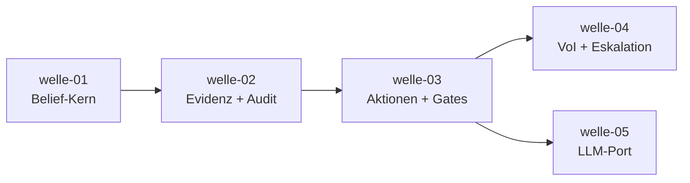

# Roadmap — belief-agent

**Status:** Aktiv. **Letzte Änderung:** 2026-07-04.

**Format-Regel:** Die Roadmap ist eine Reihenfolge von **Wellen**, keine
Reihenfolge von Terminen. Termine — falls überhaupt — sind Konsequenz der
Wellen-Schätzung, nicht Treiber.

---

## Aktuelle Welle

**Welle-ID:** [`welle-01-belief-kern`](../welle-01-belief-kern.md)
**Start:** 2026-07-04 (Trigger erfüllt) — Status `in-progress`
**Geplantes Ende:** Schätzung folgt mit Slice-Priorisierung

**Closure-Trigger:** siehe Welle-Datei — gültiger, normierter Belief State
mit Resthypothese und deterministisch testbarem Bayes-Update.

**Trigger (Welle startet):** ADR-0001 `Accepted`; Implementierungssprache
via eigenem ADR entschieden (`LH-RB-04`). — **Erfüllt 2026-07-04**
(`ADR-0001` & `ADR-0002` Accepted).

## Nächste Wellen

| Welle | Trigger | Wichtigste Slices | Geschätzter Aufwand |
|---|---|---|---|
| welle-02-evidenz-audit | welle-01 done | Beobachtungs-Aufnahme, Bayes-Update-Pipeline, Audit-/Event-Log (`LH-FA-OBS`, `LH-FA-AUD`) | M |
| welle-03-aktionen-gates | welle-02 done | Wirkungsklassen, Konfidenz-Gate, menschliche Freigabe (`LH-FA-ACT`, `LH-FA-POL`) | M |
| welle-04-voi-eskalation | welle-03 done | VoI-Selektor, Eskalations-Manager, Budget (`LH-FA-VOI`, `LH-FA-ESK`) | M |
| welle-05-llm-port | welle-03 done | LLM-Port + erster Adapter, Konfidenz-Externalisierung (`LH-FA-LLM`) | L |

## Meilensteine

| Meilenstein | Welle(n) | Trigger | Status |
|---|---|---|---|
| M1 — Belief-Kern lauffähig | welle-01 | normierter Belief State + Bayes-Update grün | offen |
| M2 — vollständiger Entscheidungszyklus | welle-02, welle-03, welle-04 | Gate + VoI + Eskalation im Zusammenspiel | offen |
| M3 — Sprachmodell angebunden | welle-05 | LLM-Port mit erstem Adapter, Konfidenz extern protokolliert | offen |

## Abhängigkeitsgraph

## Abgeschlossene Wellen

(noch keine)

## Historische Trigger-Verschiebungen

| Datum | Was wurde geändert? | Warum? |
|---|---|---|
| 2026-06-22 | Initiale Roadmap (Bootstrap) | — |
| 2026-07-04 | Welle-01 gestartet (Status `in-progress`); Slices `slice-001`..`slice-004` in `open/` angelegt | Start-Trigger erfüllt: `ADR-0001` & `ADR-0002` Accepted |
