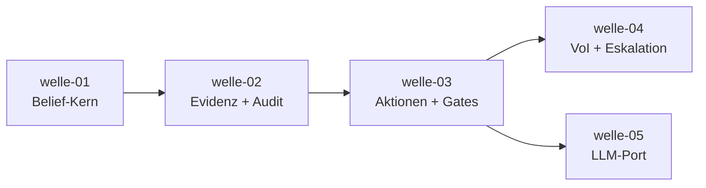

# Roadmap — belief-agent

**Status:** Aktiv. **Letzte Änderung:** 2026-07-04.

**Format-Regel:** Die Roadmap ist eine Reihenfolge von **Wellen**, keine
Reihenfolge von Terminen. Termine — falls überhaupt — sind Konsequenz der
Wellen-Schätzung, nicht Treiber.

---

## Aktuelle Welle

**Welle-ID:** [`welle-01-belief-kern`](../welle-01-belief-kern.md)
**Start:** 2026-07-04 (Trigger erfüllt) — Status `in-progress`
**Geplantes Ende:** Schätzung folgt mit Slice-Priorisierung

**Closure-Trigger:** siehe Welle-Datei — gültiger, normierter Belief State
mit Resthypothese und deterministisch testbarem Bayes-Update.

**Trigger (Welle startet):** ADR-0001 `Accepted`; Implementierungssprache
via eigenem ADR entschieden (`LH-RB-04`). — **Erfüllt 2026-07-04**
(`ADR-0001` & `ADR-0002` Accepted).

## Nächste Wellen

| Welle | Trigger | Wichtigste Slices | Geschätzter Aufwand |
|---|---|---|---|
| welle-02-evidenz-audit | welle-01 done | Beobachtungs-Aufnahme, Bayes-Update-Pipeline, Audit-/Event-Log (`LH-FA-OBS`, `LH-FA-AUD`) | M |
| welle-03-aktionen-gates | welle-02 done | Wirkungsklassen, Konfidenz-Gate, menschliche Freigabe (`LH-FA-ACT`, `LH-FA-POL`) | M |
| welle-04-voi-eskalation | welle-03 done | VoI-Selektor, Eskalations-Manager, Budget (`LH-FA-VOI`, `LH-FA-ESK`) | M |
| welle-05-llm-port | welle-03 done | LLM-Port + erster Adapter, Konfidenz-Externalisierung (`LH-FA-LLM`) | L |

## Meilensteine

Meilenstein-/Release-Punkte sind **extern beobachtbare Zustände** und leiten
sich aus *tatsächlich existierenden* Wellen/Slices ab (Regelwerk Modul 06) —
**keine Vorab-Bindung an noch nicht existierende Wellen**. Ob ein Meilenstein
bzw. Release-Punkt erreicht ist, wird **je Slice** entschieden und erst dann
mit konkreter Wellen-/Slice-Bindung eingetragen, wenn die liefernden Slices
in `done/` sind.

| Meilenstein | Welle(n)/Slice(s) | Trigger (beobachtbar) | Status |
|---|---|---|---|
| M1 — Belief-Kern lauffähig | welle-01 (`slice-001`..`slice-004`) | ungültiger Belief State wird nachweislich zurückgewiesen (`LH-FA-BEL-004`) **und** deterministisches Bayes-Update grün (`make test`) | offen |

**Ausblick (unverbindlich, noch ohne Wellen-Bindung):** vollständiger
Entscheidungszyklus (Gate + VoI + Eskalation) und Sprachmodell-Anbindung sind
erklärte spätere Ziele. Sie werden als Meilenstein mit beobachtbarem Trigger
eingetragen, sobald die tragenden Slices existieren und ein Release-/
Beobachtungs-Punkt tatsächlich erreicht ist — Entscheidung je Slice.

## Abhängigkeitsgraph

## Abgeschlossene Wellen

(noch keine)

## Historische Trigger-Verschiebungen

| Datum | Was wurde geändert? | Warum? |
|---|---|---|
| 2026-06-22 | Initiale Roadmap (Bootstrap) | — |
| 2026-07-04 | Welle-01 gestartet (Status `in-progress`); Slices `slice-001`..`slice-004` in `open/` angelegt | Start-Trigger erfüllt: `ADR-0001` & `ADR-0002` Accepted |
| 2026-07-04 | Meilensteine entkoppelt: M2/M3-Vorab-Bindung an noch nicht existierende Wellen entfernt (Je-Slice-Entscheidung); M1-Trigger auf beobachtbaren Zustand geschärft | Regelwerk Modul 06: keine Phantom-Bindung, beobachtbare Trigger |
