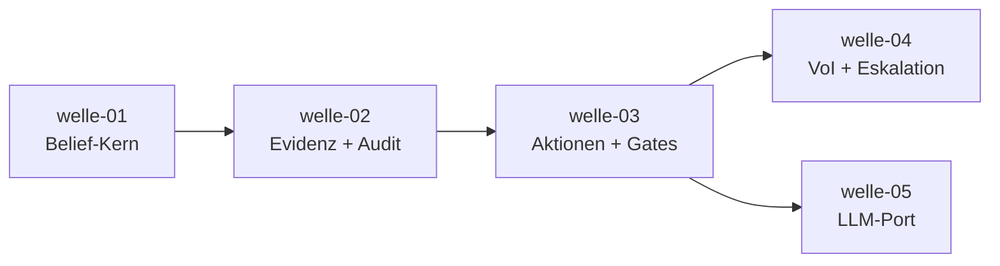

# Roadmap — belief-agent

**Status:** Aktiv. **Letzte Änderung:** 2026-07-06.

**Format-Regel:** Die Roadmap ist eine Reihenfolge von **Wellen**, keine
Reihenfolge von Terminen. Termine — falls überhaupt — sind Konsequenz der
Wellen-Schätzung, nicht Treiber.

---

## Aktuelle Welle

**welle-05-llm-port ist aktiv** (seit 2026-07-06). `welle-04-voi-eskalation`
ist **abgeschlossen** (2026-07-06;
[Ergebnisse](../done/welle-04-voi-eskalation-results.md)) und der Korrektur-Slice
`slice-018` (Schwellwert-Reconciliation, `ADR-0008` **supersedes** `ADR-0005`) ist
**erledigt** ([done](../done/slice-018-schwellwert-reconciliation.md)) — die
Gate-/Resthypothese-Schwellen sind jetzt spec-konform (verschärft: θ_other_block
0,10, θ_repository 0,80, θ_extern 0,95, θ_rehyp 0,30).

**Aktiver Slice:** [`slice-019`](slice-019-llm-framework-adapter.md) — echte
LangChain4j- und Koog-Adapter hinter dem bestehenden `LlmPort`; belief-agent
orchestriert und gated, die LLM-Frameworks liefern strukturierte Likelihood-
Einschaetzungen.

**⇒ Resume-Punkt (2026-07-06):** `slice-019` abschliessen, danach Folge-Slices der
Welle 05 schneiden: belief-abhaengige VoI-Kandidaten (F4b),
Konfidenz-Externalisierung/Golden-Set und produktiver Composition-Root.

**Offen im Blick:** `B4` (M2-Formulierung in welle-02/03/04) optionale Konventions-
Bereinigung. Tracked Follow-ups (welle-05): Executor darf nur
`Aktionsfreigabe.Freigegeben` (a-check-Regel); echter Approval-Adapter mit Binding;
produktiver cli-Composition-Root (`ARC-09`-Verdrahtung).

## Nächste Wellen

| Welle | Trigger | Wichtigste Slices | Geschätzter Aufwand |
|---|---|---|---|
| welle-05-llm-port | welle-03 done (erfüllt) | LLM-Port-Adapter, belief-abhaengige VoI-Kandidaten, Konfidenz-Externalisierung (`LH-FA-LLM`) | L |

## Meilensteine

Meilenstein-/Release-Punkte sind **extern beobachtbare Zustände** und leiten
sich aus *tatsächlich existierenden* Wellen/Slices ab (Regelwerk Modul 06) —
**keine Vorab-Bindung an noch nicht existierende Wellen**. Ob ein Meilenstein
bzw. Release-Punkt erreicht ist, wird **je Slice** entschieden und erst dann
mit konkreter Wellen-/Slice-Bindung eingetragen, wenn die liefernden Slices
in `done/` sind.

| Meilenstein | Welle(n)/Slice(s) | Trigger (beobachtbar) | Status |
|---|---|---|---|
| M1 — Belief-Kern lauffähig | welle-01 (`slice-001`..`slice-004`) | ungültiger Belief State wird nachweislich zurückgewiesen (`LH-FA-BEL-004`) **und** deterministisches Bayes-Update grün (`make test`) | **erreicht (2026-07-04)** |

**Ausblick (unverbindlich, noch ohne Wellen-Bindung):** vollständiger
Entscheidungszyklus (Gate + VoI + Eskalation) und Sprachmodell-Anbindung sind
erklärte spätere Ziele. Sie werden als Meilenstein mit beobachtbarem Trigger
eingetragen, sobald die tragenden Slices existieren und ein Release-/
Beobachtungs-Punkt tatsächlich erreicht ist — Entscheidung je Slice.

## Abhängigkeitsgraph

## Abgeschlossene Wellen

| Welle | Abgeschlossen | Ergebnis |
|---|---|---|
| `welle-01-belief-kern` | 2026-07-04 | M1 erreicht; 30 Tests, 94,83 % Coverage; [Ergebnisse](../done/welle-01-belief-kern-results.md). Rest: `CO-001` (arch-check). |
| `welle-02-evidenz-audit` | 2026-07-05 | Evidenz→Belief→Audit E2E; 71 Tests, 97,37 % Coverage (domain); [Ergebnisse](../done/welle-02-evidenz-audit-results.md). a-check v0.11.0 (Multi-Modul), Regelwerk v1.4.0 vendored. |
| `welle-03-aktionen-gates` | 2026-07-05 | Sicherheitsfunktion (`MR-003`): Wirkungsklassen + Konfidenz-Gate + menschliche Freigabe; 102 Tests, 97,65 % Coverage (domain); [Ergebnisse](../done/welle-03-aktionen-gates-results.md). 2 Code-Reviews (7 Safety-Befunde fail-closed gefixt), `ADR-0005` Accepted. |
| `welle-04-voi-eskalation` | 2026-07-06 | Entscheidungszyklus (`ARC-09`: sammeln \| handeln \| eskalieren); VoI-Selektor + Eskalation + Budget + `voi-fake`; 151 Tests, 98,17 %/98,73 % Coverage (domain/app); [Ergebnisse](../done/welle-04-voi-eskalation-results.md). Sequentielles + Ketten-Review (10 Befunde), `ADR-0007` Accepted. |

## Historische Trigger-Verschiebungen

| Datum | Was wurde geändert? | Warum? |
|---|---|---|
| 2026-06-22 | Initiale Roadmap (Bootstrap) | — |
| 2026-07-04 | Welle-01 gestartet (Status `in-progress`); Slices `slice-001`..`slice-004` in `open/` angelegt | Start-Trigger erfüllt: `ADR-0001` & `ADR-0002` Accepted |
| 2026-07-04 | Meilensteine entkoppelt: M2/M3-Vorab-Bindung an noch nicht existierende Wellen entfernt (Je-Slice-Entscheidung); M1-Trigger auf beobachtbaren Zustand geschärft | Regelwerk Modul 06: keine Phantom-Bindung, beobachtbare Trigger |
| 2026-07-04 | Welle-01 abgeschlossen (Status `done`, Slices → `done/`); M1 erreicht; `CO-001` (arch-check) angelegt | Closure-Trigger erfüllt; `make gates` grün, Review durchgeführt |
| 2026-07-04 | `CO-001` aufgelöst: a-check v0.10.0 (fail-closed-Fix); `arch-check` verdrahtet, `make gates` = 5 Gates | Upstream-Fix des gemeldeten KMP-Falsch-negativ |
| 2026-07-04 | welle-02-evidenz-audit aufgesetzt (`slice-005`..`slice-008` in `open/`); d-check-Module erweitert (`MR-006`) + `version.md` | welle-01 done → nächste Welle |
| 2026-07-05 | `slice-006` geliefert (Dedup korrelierter Beobachtungen, `LH-FA-OBS-004`); Resume-Punkt → `slice-007` | `make gates` grün (46 Tests, 96,81 % Coverage); DoD erfüllt, liegt in `in-progress/` bis Welle-Closure |
| 2026-07-05 | `slice-007` geliefert (Ereignisprotokoll + Rekonstruktion, `LH-FA-AUD-001`/`002`/`003`); Audit-Port nach `slice-008` verschoben (Weg C); Resume-Punkt → `slice-008` | `make gates` grün (59 Tests, 97,37 % Coverage); Audit-Port ist anwendungsweiter Port → application-Schicht (`architecture.md` §2), nicht Domäne; slice-007 bleibt reiner domain-Slice |
| 2026-07-05 | `slice-008` zerlegt (Modul 5, zu groß): `slice-008` (Fundament: Modul + Audit-Port + Multi-Modul-`arch-check`), `slice-009` (Pipeline), `slice-010` (Quelle + E2E) | 7 DoD-Punkte über mehrere Schichten + Multi-Modul-a-check-Risiko → nicht in einer Sitzung lieferbar; Schnitt nach Lieferwert; a-check-Risiko zuerst isoliert retiren |
| 2026-07-05 | `slice-008` (Fundament) geliefert; a-check v0.10.0 → **v0.11.0** (Multi-Modul-KMP-Resolution, `MR-005`); Resume-Punkt → `slice-009` | v0.10.0 konnte Multi-Modul nicht durchsetzen (Guard-Reject bzw. falsch-grün, negativ-getestet); Fix-Prompt an a-check → v0.11.0 löst datei-mengen-bewusst auf, echt durchsetzend; kein Carveout |
| 2026-07-05 | `slice-009` (Pipeline `belief-aktualisieren`) geliefert; erstes `adapters:*`-Modul `llm-fake`; Resume-Punkt → `slice-010` | `make gates` grün (67 Tests); Use-Case + LLM-/Uhr-Port + Fake-LLM; arch-check echt über domain/application/adapters (a-check v0.11.0, Adapter-Root ergänzt) |
| 2026-07-05 | `slice-010` geliefert (Beobachtungs-Port + Quelle-/Audit-Adapter + E2E); **welle-02-Closure-Trigger erfüllt** | `make gates` grün (71 Tests); E2E `Quelle→Update→Protokoll→Persistenz→Rekonstruktion` demonstriert die Welle-Ziele (`LH-FA-OBS-001`/`002`, `LH-FA-AUD-002`) |
| 2026-07-05 | `welle-02-evidenz-audit` **abgeschlossen** (Slices `005`..`010` → `done/`); „Aktuelle Welle" → Ruhe-Marker | Closure-Trigger erfüllt (alle Slices done, E2E grün); Lerneintrag in `done/welle-02-evidenz-audit-results.md` |
| 2026-07-05 | `welle-03-aktionen-gates` aufgesetzt (Plan + `slice-011`/`012`/`013` in `open/`) | welle-02 done → nächste Welle; Zuschnitt nach Lieferwert: Domäne Aktion+Wirkungsklassen / Gate-Regel / aktion-gaten+Freigabe (`LH-FA-ACT`/`LH-FA-POL`) |
| 2026-07-05 | welle-03 aktiviert; `slice-011` geliefert (Domäne Aktion + 4 Wirkungsklassen + Erfolgs-P + Evidenz-Ref, `LH-FA-ACT-001`..`004`); Resume-Punkt → `slice-012` | `make gates` grün (78 Tests, 97,71 % Coverage); Ruhe-Marker → welle-03 aktiv (slice-011 in `in-progress/`) |
| 2026-07-05 | `slice-012` geliefert (Konfidenz-Gate-Regel + `ADR-0005` Schwellwerte, `LH-FA-POL-001`/`002`/`003`/`005`/`007`); Resume-Punkt → `slice-013` | `make gates` grün (88 Tests, 98,1 % Coverage); Sicherheitskern (`MR-003`), fail-safe (Resthypothese-Sperre schlägt hohe Erfolgs-P) negativ-getestet |
| 2026-07-05 | Code-Review slice-012: 2 Safety-Inversionen in `GateSchwellen` gefixt (fail-closed Monotonie + Sperr-Schwelle `< 1`); `ADR-0005` → Accepted | Multi-Agent-Review fand config-erreichbare unsichere Freigabe-Pfade; 5 Tests ergänzt (93 gesamt) |
| 2026-07-05 | `slice-013` geliefert (aktion-gaten: nicht-umgehbares Gate + Human-Approval-Port, `LH-FA-POL-004`/`006`); **welle-03-Closure-Trigger erfüllt** | `make gates` grün (101 Tests); Gate-Kette E2E (extern-wirksam nur mit Freigabe frei, sonst Eskalation) |
| 2026-07-05 | Ketten-Review welle-03 (+ welle-02 retrospektiv): 7 Befunde fail-closed gefixt (u. a. fail-open-Prädikat, strukturelle POL-006, welle-02 Uhr-Monotonie/Rekonstruierbarkeit) | Reviews von Sicherheitsfunktionen an die Welle-Grenze; Ketten-Sicht findet Fehler, die Einzel-Slices verbergen |
| 2026-07-05 | `welle-03-aktionen-gates` **abgeschlossen** (Slices `011`..`013` → `done/`); „Aktuelle Welle" → Ruhe-Marker | Closure-Trigger erfüllt; Lerneintrag in `done/welle-03-aktionen-gates-results.md` |
| 2026-07-05 | Coverage-Gate auf `application` + Adapter erweitert (`ADR-0006`, per-Modul kover, kein zentraler Block); Sicherheitskern `AktionGaten` jetzt gate-erzwungen | `make gates` grün; Ist-Coverage application + Adapter 100 %, domain 97,65 % → 90 %-Floor |
| 2026-07-05 | `welle-04-voi-eskalation` **aufgesetzt** (Plan + `slice-014`/`015`/`016` in `open/`); noch nicht gestartet (Ruhe-Marker bleibt) | Trigger „welle-03 done" erfüllt; Slice-Anlage Welle für Welle (Modul 6) |
| 2026-07-05 | **Tagesabschluss** — Resume-Punkt: welle-04 starten via `slice-014` | 3 Wellen done + Coverage-Scope (`ADR-0006`) + welle-04 aufgesetzt; alle Gates grün, Working Tree sauber |
| 2026-07-06 | **welle-04 gestartet**; `slice-014` `open → in-progress`, Ruhe-Marker aufgelöst; `slice-014` geliefert (VoI-Selektor + `VoiKandidat`, neue Sub-Area `hexagon:domain/voi`, `LH-FA-VOI-002`/`003`/`004`); Resume-Punkt → `slice-015` | Start-Trigger „welle-03 done" erfüllt; reine Domänen-Regel als kleiner Einstieg; `make gates` grün (doc-check/build/test/coverage-gate/arch-check 0 Befunde, domain 97,81 %), 14 neue Tests |
| 2026-07-06 | Planungs-Konvention: **keine eigenständigen Wellen-Dateien** mehr (`MR-009`); `welle-01..04-*.md` + `welle.template.md` entfernt, Wellen nur als Roadmap-Eintrag + `done/…-results.md` | Referenz-Projekt-Modell (`lab/example`); 23 Verweise umgebogen; `make doc-check` grün |
| 2026-07-06 | `slice-015` `open → in-progress` **geliefert** (Eskalation-Zustand + Bedingung + Budget, neue Sub-Area `hexagon:domain/eskalation`, `LH-FA-ESK-001`..`004`); Resume-Punkt → `slice-016` | Domänen-Bausteine der Welle-04-Eskalation; θ_esc an θ_rehyp gekoppelt; `make gates` grün (domain 98,13 %), 21 neue Tests |
| 2026-07-06 | `slice-016` **zerlegt** (Modul 5, `ARC-09`-Größenprüfung): `slice-016` (`beobachtung-waehlen`: VoI-Use-Case + Auswahl-Port + `voi-fake`) + `slice-017` (`entscheidungszyklus`: Orchestrierung + E2E) | Zyklus zu groß: neues Adapter-Modul + Multi-Modul-`arch-check` + E2E über mehrere Schichten → Schnitt nach Lieferwert, Modul-Risiko zuerst isolieren (Präzedenz slice-008); Architektur trennt `ARC-04`/`ARC-09` ohnehin |
| 2026-07-06 | **Sequentielles Code-Review** slice-014/015 (Fail-safe, rollierend): 5 Befunde gefixt — Eskalations-Schwelle spec-konform (θ_esc **0,5→0,30**, `>`→`≥`, `ADR-0007`, entkoppelt von Gate-Sperre); `schwelle` fail-closed; `Eskalationsgrund` trägt `GateEntscheidung` statt String; `VoiSelektor` Kreuz-Multiplikation statt Float-Division | F1 war un-ADR'te Safety-Schwelle + Unter-Eskalation im Band [0,30…0,50]; Reviews der Sicherheitsfunktion früh; `make gates` grün; offen: `STANDARD_SCHWELLWERT`-Reconciliation |
| 2026-07-06 | `slice-016` `open → in-progress` **geliefert** (`beobachtung-waehlen`: `BeobachtungsAuswahlPort` + Use-Case `BeobachtungWaehlen` + neues Adapter-Modul `adapters:outbound:voi-fake`, `LH-FA-VOI-002`); Resume-Punkt → `slice-017` | Erstes application-Slice der Welle; **Multi-Modul-/Build-Risiko isoliert & retired** (7 Module, arch-check grün); `make gates` grün (application/voi-fake 100 %), 4 neue Tests |
| 2026-07-06 | `slice-017` `open → in-progress` **geliefert** (`entscheidungszyklus`, `ARC-09`: `Entscheidungszyklus` + `Zyklusergebnis` verdrahten VoI + Belief-Update + Gate + Eskalation zu sammeln/handeln/eskalieren, `LH-FA-VOI-001`); **Welle-04-Closure-Trigger erfüllt** | Letztes Welle-Slice; E2E gegen Fake-Ports (6 Fälle, beide Eskalations-Auslöser, budget-garantierte Terminierung `LH-QA-02`); Aktionsfreigabe→GateEntscheidung-Rück-Mapping (Domäne kennt application nicht); `make gates` grün (application 100 %) |
| 2026-07-06 | **Ketten-Review** slice-016/017 (VoI + Eskalation + Zyklus): 5 Befunde gefixt — fehlende Freigabe wird jetzt **eskaliert statt still abgelehnt** (F1, `LH-FA-POL-004`); Kandidaten-**Konsumption** gg. Scheingewissheit (F4a, `LH-FA-OBS-004`); `Eskalationsgrund.GateEskalation` (F2); Approval-Pfad-Test (F3); `ARC-09`-Diagramm reconcilt (F5) | Ketten-Sicht fand Kompositions-Fehler, die Einzel-Slices verbargen (welle-03-Lehre bestätigt); `make gates` grün; offen: belief-**abhängige** Kandidaten-Generierung (F4b) = welle-05 |
| 2026-07-06 | `welle-04-voi-eskalation` **abgeschlossen** (Slices `014`..`017` → `done/`); „Aktuelle Welle" → Ruhe-Marker; Lerneintrag `done/welle-04-voi-eskalation-results.md` | Closure-Trigger erfüllt (Zyklus sammeln\|handeln\|eskalieren E2E, alle Gates grün); Resume → Schwellwert-Reconciliation **oder** welle-05 (LLM-Port) |
| 2026-07-06 | `slice-018` (Schwellwert-Reconciliation) **erledigt** → `done/`: Schwellen spec-konform verschärft (θ_other_block 0,5→0,10, θ_repo 0,7→0,80, θ_extern 0,9→0,95, θ_rehyp 0,5→0,30); `ADR-0008` **supersedes** `ADR-0005`; Resume → welle-05 | Source Precedence: Spec (Rang 2) sticht ADR (Rang 4); ADR-0005 hatte Safety-Schwellen gelockert; nur 3 Grenzfall-Tests betroffen; `make gates` grün |
| 2026-07-06 | **welle-05 gestartet**; `slice-019` in `in-progress/` angelegt (LangChain4j + Koog als echte LLM-Framework-Adapter hinter `LlmPort`) | Resume-Punkt nach `slice-018`; Multi-Adapter-Schnitt isoliert Framework-/Build-Risiko vor Modellkalibrierung und produktivem Composition-Root |
