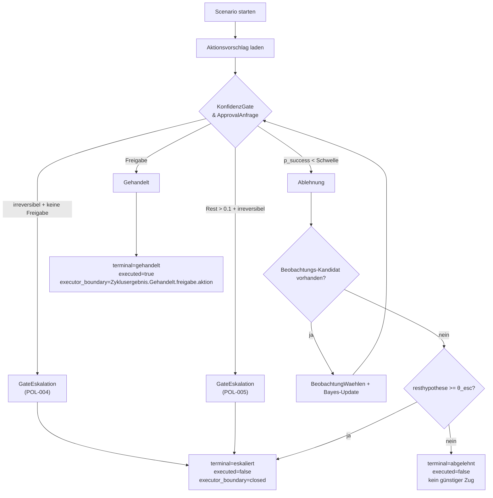
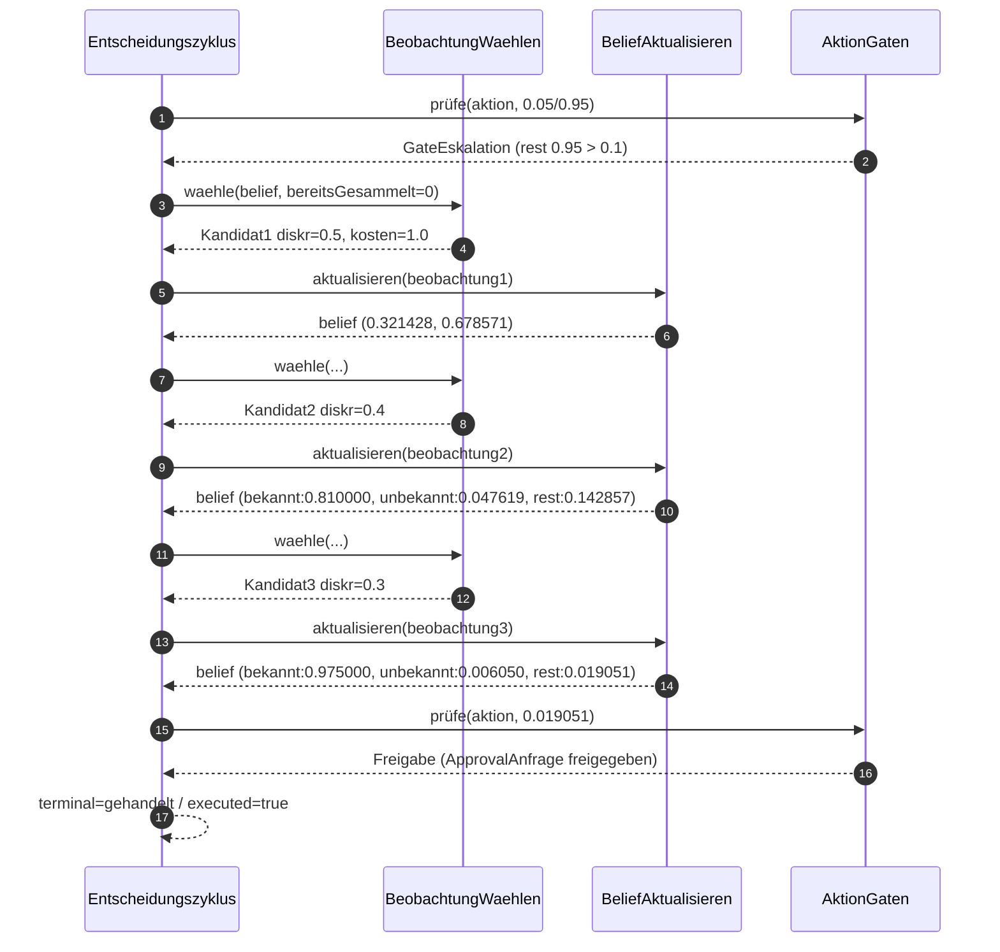

# CLI-Entscheidungsnachweis

**Zweck:** Diese Seite zeigt anhand der deterministischen Fakes, anhand welcher
Daten `belief-agent` im CLI-Run entscheidet und wann er nicht genug weiß.

**Erzeugte Szenarien:** `StandardCliSzenarien` in
[`StandardCliSzenarien.kt`](../../adapters/inbound/cli/src/main/kotlin/dev/beliefagent/adapter/cli/StandardCliSzenarien.kt)

## 1. Datenquellen

- Eingangszustand je Szenario: `prior`, `budget`, `approval`,
  `aktionsVorschlaege`, `voiKandidaten` aus
  [`StandardCliSzenarien.kt`](../../adapters/inbound/cli/src/main/kotlin/dev/beliefagent/adapter/cli/StandardCliSzenarien.kt).
- Roh-Aktionsvorschlag:
  `pSuccess`, `wirkungsklasse` und `konfidenzReferenz` aus den
  `FakeAktionsVorschlagKonfiguration`en in
  [`FakeAktionsVorschlagsPort.kt`](../../adapters/outbound/llm-action-fake/src/commonMain/kotlin/dev/beliefagent/adapter/llmaction/FakeAktionsVorschlagsPort.kt).
- Modell-zu-Daten-Konvertierung:
  `KonfidenzExternalisieren` schreibt die `p_success` als Version `1` für die
  angegebene Referenz in den
  `KonfidenzPort` (append-only, Memory-Adapter in
  [`Runtime.kt`](../../adapters/inbound/cli/src/main/kotlin/dev/beliefagent/adapter/cli/Runtime.kt)
  via `MemoryKonfidenzPort`).
- LLM-Likelihoods und Bayes-Update:
  Fake-Likelihoods aus [`FakeLlm.kt`](../../adapters/outbound/llm-fake/src/commonMain/kotlin/dev/beliefagent/adapter/llm/FakeLlm.kt),
  Update-Logik in [`BayesUpdate.kt`](../../hexagon/domain/src/commonMain/kotlin/dev/beliefagent/domain/belief/BayesUpdate.kt).
- Beobachtungs-Auswahl: deterministisch top-gain über
  [`VoiSelektor`](../../hexagon/domain/src/commonMain/kotlin/dev/beliefagent/domain/voi/VoiSelektor.kt),
  Datenquelle in [`FakeKandidatenquelle`](../../adapters/outbound/voi-fake/src/commonMain/kotlin/dev/beliefagent/adapter/voi/FakeKandidatenquelle.kt).
- Re-Hypothesen: Auslösung bei Resthypothese `> 0.3` in
  [`ReHypothesenAusloeser`](../../hexagon/domain/src/commonMain/kotlin/dev/beliefagent/domain/belief/ReHypothesenAusloeser.kt),
  Kandidaten aus
  [`FakeHypothesenPort`](../../adapters/outbound/llm-hypothesen-fake/src/commonMain/kotlin/dev/beliefagent/adapter/llmhypothesen/FakeHypothesenPort.kt).
- Approval-Kontext: `AktionGaten` ruft den `HumanApprovalPort` nur nach
  bestandener `KonfidenzGate`-Freigabe fuer irreversible Aktionen auf und
  uebergibt eine `ApprovalAnfrage` aus konkreter Aktion und aktuellem
  `BeliefState`. Der lokale Adapter `LocalApproval` bindet diese Anfrage an
  Nonce, Identitaet und Kontext-Digest. Der CLI-Composition-Root bindet diesen
  Adapter nur bei explizitem `approval=local`; ohne diesen Schalter gelten die
  je Szenario gesetzten Fake-Approval-Defaults.

## 2. Entscheidung je Szenario

## 2.1 `gehandelt`

- Input:
  - `prior = {hypothese=0.9, resthypothese=0.1}`
  - `p_success = 0.8`
  - `wirkungsklasse = ARBEITSBEREICH_LOKAL`
  - `approval = fake(false)`
  - `budget = 3` (Default)
  - `voiKandidaten = []` (keine Sammlung nötig)
- Gate-Pfad:
  1. `KonfidenzGate`: irreversibel=false, Resthypothese 0.1 ist nicht
     über `θ_other_block=0.1` (strikt `>`), daher kein Hard-Block.
  2. `aktionGaten` prüft Erfolgsschwelle für
     `ARBEITSBEREICH_LOKAL = 0.5`.
  3. `p_success 0.8 >= 0.5` => `Freigabe`.
- Ergebnis:
  - `terminal=gehandelt`
  - `executed=true`
  - `executor_boundary=Zyklusergebnis.Gehandelt.freigabe.aktion`
  - `resthypothese=0.100000`

## 2.2 `eskaliert`

- Input:
  - `prior = {hypothese=0.9, resthypothese=0.1}`
  - `p_success = 0.95`
  - `wirkungsklasse = EXTERN_WIRKSAM`
  - `approval = fake(false)`
  - `budget = 3` (Default)
  - `voiKandidaten = []`
- Gate-Pfad:
  1. `KonfidenzGate`: `Resthypothese=0.1` ist nicht über der
     Sperrschwelle, daher kein `Eskalation` aus `POL-005`.
  2. `aktionGaten` prüft Erfolgs-/Schwelle
     `EXTERN_WIRKSAM = 0.95`.
  3. `p_success 0.95 >= 0.95` wäre gate-fähig, aber Aktion ist
     irreversibel und die kontextgebundene `ApprovalAnfrage` wird vom Fake
     nicht freigegeben.
  4. `AktionGaten` wandelt auf `Eskalation` (LH-FA-POL-004).
- Ergebnis:
  - `terminal=eskaliert`
  - `executed=false`
  - `reason=GateEskalation`
  - `executor_boundary=closed`
  - `resthypothese=0.100000`

### Lokaler Approval-Pfad fuer `eskaliert`

Wird dasselbe Szenario bewusst mit `approval=local` gestartet, rendert der
CLI-Root die lokale Approval-Challenge mit Nonce, Kontext-Digest, Aktion,
Wirkungsklasse, `p_success` und Resthypothese. Nur eine Antwort mit derselben
Nonce, nicht leerer Identitaet, gleichem Kontext-Digest und exakter
Bestaetigung `FREIGEBEN` gibt die Anfrage frei.

- passende lokale Freigabe:
  - `terminal=gehandelt`
  - `executed=true`
  - `executor_boundary=Zyklusergebnis.Gehandelt.freigabe.aktion`
- fehlende, falsche oder wiederverwendete lokale Freigabe:
  - `terminal=eskaliert`
  - `executed=false`
  - `executor_boundary=closed`

## 2.3 `abgelehnt`

- Input:
  - `prior = {hypothese=0.9, resthypothese=0.1}`
  - `p_success = 0.3`
  - `wirkungsklasse = ARBEITSBEREICH_LOKAL`
  - `approval = fake(false)`
  - `budget = 3`
  - `voiKandidaten = []`
- Gate-Pfad:
  1. `KonfidenzGate`: `p_success 0.3 < 0.5` bei
     `ARBEITSBEREICH_LOKAL` => `Ablehnung`.
  2. `Entscheidungszyklus` versucht zu sammeln, hat aber keine Kandidaten.
  3. Beobachtungen erschöpft, aber `resthypothese=0.1 < θ_esc=0.3`,
     daher `Abgelehnt` statt `Eskalieren`.
- Ergebnis:
  - `terminal=abgelehnt`
  - `executed=false`
  - `reason=günstige Beobachtungen erschöpft, Resthypothese unter θ_esc — kein
    günstiger Zug`
  - `executor_boundary=closed`
  - `resthypothese=0.100000`

## 2.4 `sammelt-dann-handelt`

- Input:
  - `prior = {hypothese=0.05, resthypothese=0.95}`
  - `p_success = 0.95`
  - `wirkungsklasse = EXTERN_WIRKSAM`
  - `approval = fake(true)`
  - `budget = 5`
  - `voiKandidaten`: drei Kandidaten:
    `diskriminierung = [0.5, 0.4, 0.3]`, Kosten je `1.0`.
- Gate-/Sammler-Pfad:
  1. Zyklusstart: `Resthypothese 0.95 > 0.1` => zunächst Gate-Eskalation.
  2. Es gibt Kandidaten, also wird gesammelt:
     1) Kandidat 0.5 -> Posterior
        `(hyp:0.321428, rest:0.678571)`, danach Re-Hypothese (Rest > 0.3) fügt
        `fake-hypothese-unbekannte-ursache` mit `score=0.25` hinzu.
     2) Kandidat 0.4 -> Posterior ca. `(bekannt:0.810000, unbekannt:0.047619,
        rest:0.142857)`.
     3) Kandidat 0.3 -> Posterior `(bekannt:0.975000, unbekannt:0.006050,
        rest:0.019051)`.
  3. Nach dem dritten Schritt gilt `resthypothese ≤ 0.1` und
     `p_success = 0.95 >= 0.95`, irreversibel + Freigabe fuer die aktuelle
     `ApprovalAnfrage` vorhanden.
  4. Zyklus wird frei und führt aus.
- Ergebnis:
  1. `terminal=gehandelt`
  2. `executed=true`
  3. `reason=gate_freigegeben`
  4. `executor_boundary=Zyklusergebnis.Gehandelt.freigabe.aktion`
  5. `resthypothese=0.019051`

## 3. Reproduzierbarkeit

- `make cli-demo` (zeigt nur `scenario=gehandelt`/positivpfad).
- `make cli-demo-szenarios` (zeigt alle vier Szenarien inklusive `executed=false` bei
  eskalierten/abgelehnten Fällen).
- `make cli-demo-scenarios`-Ausgabe enthält die Daten exakt in den Feldern
  `scenario`, `terminal`, `executed`, `reason`, `executor_boundary`,
  `resthypothese`.

## 4. Kompakte Entscheidungs-Matrix

| Scenario               | Start-belief `(hyp,rest)` | p_success | Wirkungsklasse         | Approval | Budget | Rest-Hypothese Start | Schwelle | Kern-Entscheidungszweig                                    | Terminal    | executed | Rest-Hypothese Ende |
| ---------------------- | ------------------------: | --------: | ---------------------- | -------- | -----: | -------------------: | -------: | ---------------------------------------------------------- | ----------- | -------: | ------------------: |
| `gehandelt`            |              `(0.9, 0.1)` |     `0.8` | `ARBEITSBEREICH_LOKAL` | nein     |    `3` |           `0.100000` |    `0.5` | Gate-Freigabe                                              | `gehandelt` |   `true` |          `0.100000` |
| `eskaliert`            |              `(0.9, 0.1)` |    `0.95` | `EXTERN_WIRKSAM`       | nein     |    `3` |           `0.100000` |   `0.95` | Gate-Eskalation (POL-004)                                  | `eskaliert` |  `false` |          `0.100000` |
| `abgelehnt`            |              `(0.9, 0.1)` |     `0.3` | `ARBEITSBEREICH_LOKAL` | nein     |    `3` |           `0.100000` |    `0.5` | Ablehnung + Beobachtungen erschöpft + `rest < θ_esc`       | `abgelehnt` |  `false` |          `0.100000` |
| `sammelt-dann-handelt` |            `(0.05, 0.95)` |    `0.95` | `EXTERN_WIRKSAM`       | ja       |    `5` |           `0.950000` |   `0.95` | 3× Sammeln (`0.5`, `0.4`, `0.3`) → Rest sinkt unter Sperre | `gehandelt` |   `true` |          `0.019051` |

## 4.1 Vollständige Matrix mit Gründen

| Scenario               | Start-belief `(hyp,rest)` | p_success | Klasse                 | Approval | Budget | Start-rest | Rest-Schwelle | `theta_esc`                                   | Erstentscheidung                                                                   | Grund (`reason`) | terminal | executed                                   | executor_boundary | Rest nach Ende |
| ---------------------- | ------------------------: | --------: | ---------------------- | -------- | -----: | ---------: | ------------: | ----------------------------------------------- | ---------------------------------------------------------------------------------- | ---------------- | -------- | ------------------------------------------ | ----------------: | -------------- |
| `gehandelt`            |              `(0.9, 0.1)` |     `0.8` | `ARBEITSBEREICH_LOKAL` | nein     |    `3` | `0.100000` |        `0.5` | `0.30`                           | `0.8 >= 0.5` → Freigabe                         | `gate_freigegeben`                                                                 | `gehandelt`      | `true`   | `Zyklusergebnis.Gehandelt.freigabe.aktion` | `0.100000` |
| `eskaliert`            |              `(0.9, 0.1)` |    `0.95` | `EXTERN_WIRKSAM`       | nein     |    `3` | `0.100000` |       `0.95` | `0.30`                           | keine Freigabe bei irreversibler Aktion         | `GateEskalation`                                                                   | `eskaliert`      | `false`  | `closed`                                   | `0.100000` |
| `abgelehnt`            |              `(0.9, 0.1)` |     `0.3` | `ARBEITSBEREICH_LOKAL` | nein     |    `3` | `0.100000` |        `0.5` | `0.30`                           | `0.3 < 0.5` → ablehnen, danach keine Kandidaten | `günstige Beobachtungen erschöpft, Resthypothese unter θ_esc — kein günstiger Zug` | `abgelehnt`      | `false`  | `closed`                                   | `0.100000` |
| `sammelt-dann-handelt` |            `(0.05, 0.95)` |    `0.95` | `EXTERN_WIRKSAM`       | ja       |    `5` | `0.950000` |       `0.95` | `0.30`                           | 3 Sammelzyklen senken Rest auf `0.019051`       | `gate_freigegeben`                                                                 | `gehandelt`      | `true`   | `Zyklusergebnis.Gehandelt.freigabe.aktion` | `0.019051` |

## 5. Entscheidungsfluss

### 5.1 Fokus: `sammelt-dann-handelt`

