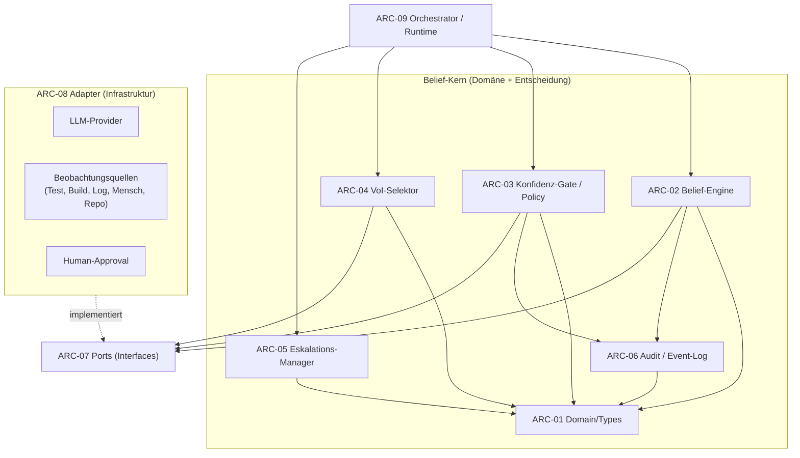
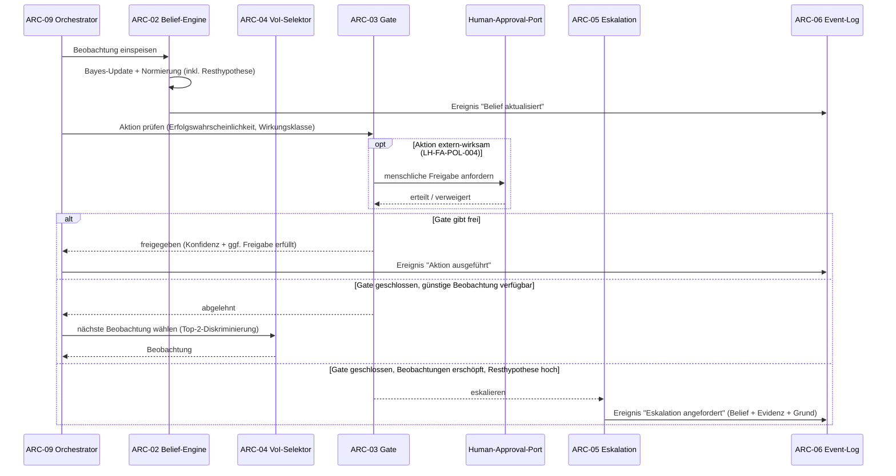

# Architektur — belief-agent

**Status:** Aktiv. **Letzte Änderung:** 2026-06-23.

**Hard Rule:** Diese Datei enthält *keine* Wellen, Slices, Commit-Hashes
oder Closure-Daten. Die zeitliche Schicht lebt in
`docs/plan/planning/in-progress/roadmap.md` und den späteren Closure-Notizen.
Sie ist sprach- und meilensteinfrei und enthält **keine eigenen
Anforderungen** — diese stehen im Lastenheft (`LH-*`).

---

## 1. Komponenten-Übersicht

Hexagonale Architektur (Ports & Adapter): Der **Belief-Kern** (Domäne +
Entscheidungslogik) ist von der Außenwelt entkoppelt. Das Sprachmodell und
alle Beobachtungsquellen sind **Adapter hinter Ports** — austauschbar und
nicht Teil des Kerns (`LH-FA-LLM-001`, `LH-QA-04`).

## 2. Schichten und Constraints

Die tragende Layering-Regel erzwingt, dass die **Entscheidungs- und
Kontrolllogik außerhalb des Sprachmodells** liegt: Der Kern definiert die
Ports, die Adapter implementieren sie — der Kern importiert **nie** einen
Adapter. Damit ist das LLM ein austauschbares Modul, nicht der Agent
(`LH-FA-LLM-001`).

| Schicht | Verantwortlichkeit | Darf importieren | Darf NICHT importieren |
|---|---|---|---|
| ARC-01 Domain/Types | Hypothese, Belief State (inkl. Resthypothese), Evidenz, Beobachtung, Aktion, Wirkungsklasse, Eskalations-Zustand, Ereignis — pur | — | alles andere |
| ARC-02 Belief-Engine | Bayes-Update, Normierung inkl. Resthypothese, Dedup korrelierter Evidenz, Unsicherheitsmaße, Re-Hypothesen-/Likelihood-Erzeugung über LLM-Port | Types, Audit, Ports | Adapter, Runtime |
| ARC-03 Konfidenz-Gate / Policy | Prüft Erfolgswahrscheinlichkeit gegen Wirkungsklassen-Schwelle; holt bei extern-wirksamen Aktionen die menschliche Freigabe über den Human-Approval-Port; gibt frei / ab / eskaliert; liegt außerhalb der Aktion | Types, Audit, Ports | Adapter, Runtime |
| ARC-04 VoI-Selektor | Wahl der nächsten Beobachtung (Top-2-Diskriminierung, Gewinn/Kosten) | Types, Ports | Adapter, Runtime |
| ARC-05 Eskalations-Manager | Erzeugt definierten Eskalations-Zustand (kein Fehler) mit Belief + Evidenz + Grund | Types, Audit | Adapter, Runtime |
| ARC-06 Audit / Event-Log | Unveränderliche, geordnete Ereignisfolge; Belief-Rekonstruktion | Types | Adapter, Runtime |
| ARC-07 Ports | Interfaces: LLM-Port, Beobachtungs-Ports, Human-Approval-Port | Types | Adapter, Engine, Gate |
| ARC-08 Adapter | Konkrete LLM-Provider und Beobachtungsquellen | Types, Ports | Engine, Gate, VoI, Esk (Kern-Innenleben) |
| ARC-09 Orchestrator / Runtime | Agenten-Schleife (Belief → Beobachtung → Update → Gate → Aktion / VoI / Eskalation), Budget, Verdrahtung (DI) | alles oben | — |

**Nicht-Umgehbarkeit des Gates (`LH-FA-POL-006`):** Das Konfidenz-Gate
(ARC-03) ist ein eigener Schritt im Orchestrator (ARC-09) *vor* jeder
Aktionsausführung; eine Aktion erhält keinen Pfad, der das Gate auslässt.

**Port-Konsumenten.** Der Belief-Kern ist *port-führend*: Kern-Komponenten
rufen über Ports (Interfaces) nach außen, importieren aber **nie** einen
konkreten Adapter (die Layering-Regel oben verbietet Adapter-, nicht
Port-Importe). Die Engine (ARC-02) erzeugt Hypothesen/Likelihoods über den
LLM-Port; das Gate (ARC-03) holt bei extern-wirksamen Aktionen die menschliche
Freigabe über den Human-Approval-Port ein (`LH-FA-POL-004`), bevor es freigibt;
der VoI-Selektor (ARC-04) liest die Beobachtungs-Ports zur Aufzählung
verfügbarer Kandidaten. ARC-09 verdrahtet die Adapter an die Ports (DI),
beschafft Beobachtungen und führt die Agenten-Schleife.

## 3. Externe Abhängigkeiten

| System | Rolle | Substituierbarkeit |
|---|---|---|
| Sprachmodell-Anbieter | Hypothesen erzeugen/verfeinern, Likelihoods schätzen, Aktionen vorschlagen (über LLM-Port) | austauschbar (Port); kein Anbieter-Lock-in (`LH-FA-LLM-004`) |
| Versionskontrolle (Repo) | Beobachtungsquelle und Checkpoint-Substrat für Wirkungsklassen | vorausgesetzt (`LH-RB-02`) |
| Beobachtungsquellen | Test-/Build-Ergebnisse, Logs, menschliches Feedback, Repo-Inspektion | austauschbar (Ports, `LH-FA-OBS-001`) |

## 4. Sequenz-Diagramme

### Use-Case: Entscheidungszyklus mit Konfidenz-Gate (`LH-FA-OBS-002`, `LH-FA-POL-001`, `LH-FA-POL-004`)

## 5. Fehlermodelle und Resilienz

| Fehlerquelle | Behandlung-Schicht | Logging |
|---|---|---|
| Ungültiger Belief State (keine Resthypothese / nicht normiert) | ARC-02 weist zurück (`LH-FA-BEL-004`) | Ereignis im Audit-Log |
| Verrauschte / korrelierte Beobachtung | ARC-02 Dedup gegen Scheingewissheit (`LH-FA-OBS-004`) | Ereignis "Beobachtung erfasst" mit Quelle |
| Budget erschöpft (Schritte/Kosten/Zeit) | ARC-09 → ARC-05 Eskalation (`LH-FA-ESK-004`) | Ereignis "Eskalation angefordert" |
| Adapter-/Port-Ausfall (LLM, Quelle) | ARC-09 fail-safe: nicht handeln, sammeln oder eskalieren (`LH-QA-02`) | Ereignis mit Grund |
