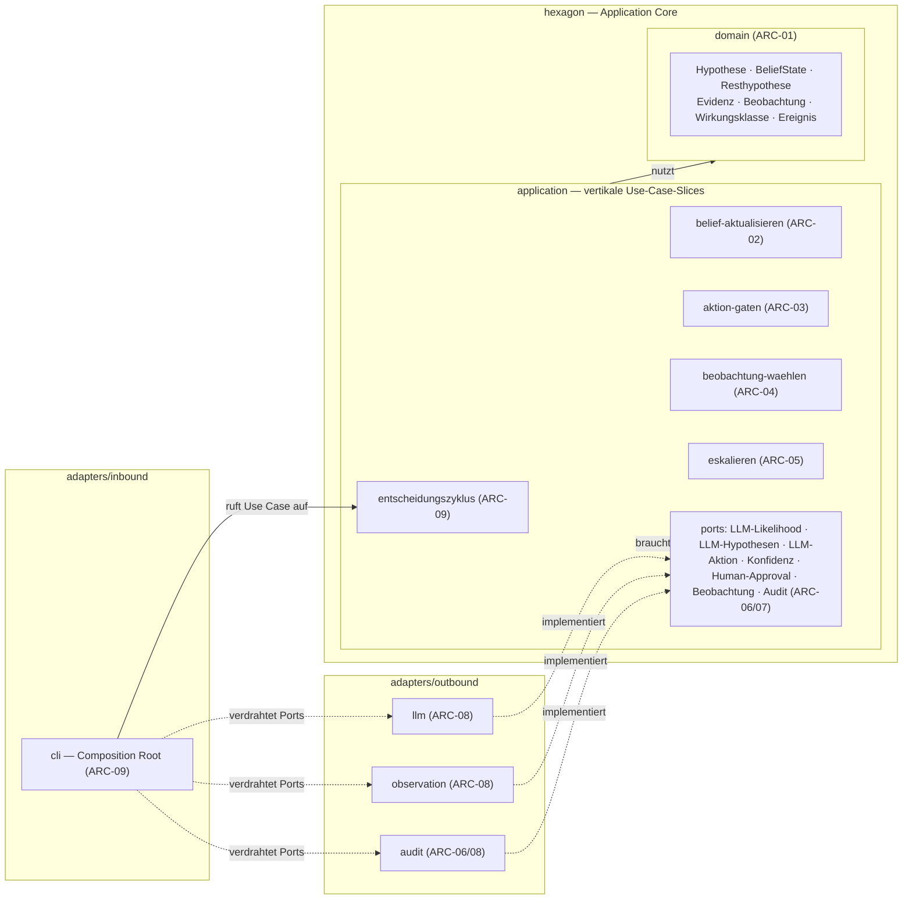
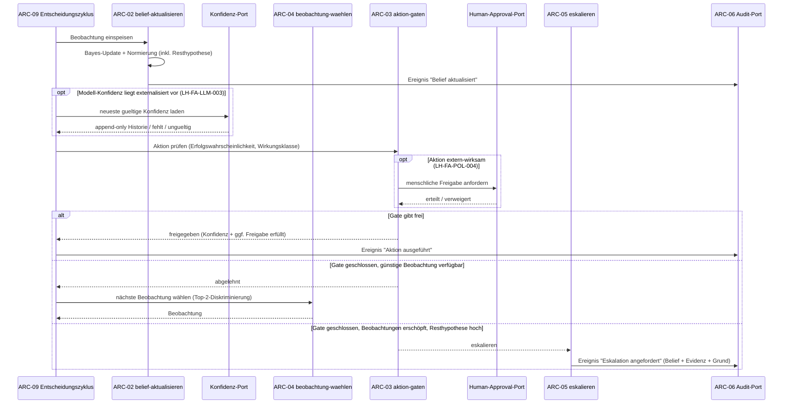

# Architektur — belief-agent

**Status:** Aktiv. **Letzte Änderung:** 2026-07-04.

**Hard Rule:** Diese Datei enthält *keine* Wellen, Slices, Commit-Hashes
oder Closure-Daten. Die zeitliche Schicht lebt in
`docs/plan/planning/in-progress/roadmap.md` und den späteren Closure-Notizen.
Sie ist sprach- und meilensteinfrei und enthält **keine eigenen
Anforderungen** — diese stehen im Lastenheft (`LH-*`).

---

## 1. Komponenten-Übersicht

**HexSlice** (Hexagonal + Vertical Slice): Der **Application Core**
(`hexagon`) ist von der Außenwelt entkoppelt; er ist nach fachlichen **Use
Cases** als vertikale Slices organisiert. Das Sprachmodell und alle
Beobachtungsquellen sind **Adapter hinter Ports** — austauschbar und nicht
Teil des Kerns (`LH-FA-LLM-001`, `LH-QA-04`). Ports gehören dem Core und
liegen so lokal wie möglich beim Use Case, der sie braucht.



## 2. Schichten und Constraints

Die tragende Layering-Regel erzwingt, dass die **Entscheidungs- und
Kontrolllogik außerhalb des Sprachmodells** liegt: Der Core definiert die
Ports, die Adapter implementieren sie — der Core importiert **nie** einen
Adapter. Damit ist das LLM ein austauschbares Modul, nicht der Agent
(`LH-FA-LLM-001`). Die Abhängigkeitsrichtung zeigt **immer nach innen**
(`adapter → application → domain`).

Verzeichnis-/Modulbaum (logisch, sprachfrei; die konkrete Toolchain-Abbildung
lebt in den Build-Dateien):

```text
hexagon/
  domain/
    belief/                    # Hypothese, BeliefState, Resthypothese, Evidenz,
                               #   Beobachtung, Wirkungsklasse, Ereignis — pur (ARC-01)
  application/
    belief/
      entscheidungszyklus/     # Agenten-Schleife: Belief→Beobachtung→Update→Gate→
                               #   Aktion/VoI/Eskalation (ARC-09-Orchestrierung)
      belief-aktualisieren/    # Bayes-Update, Normierung, Dedup, Unsicherheitsmaße (ARC-02)
        ports/                 #   → LLM-Likelihood-Port + Hypothesen-Port (lokal)
      aktionsvorschlag/        # LLM-Aktionsvorschlaege normalisieren (ARC-07)
        ports/                 #   → Aktionsvorschlags-Port (lokal)
      aktion-gaten/            # Konfidenz-Gate / Policy (ARC-03)
        ports/                 #   → Human-Approval-Port (lokal)
      beobachtung-waehlen/     # VoI-Selektor (ARC-04)
        ports/                 #   → Beobachtungs-Port (lokal)
      eskalieren/              # Eskalations-Manager (ARC-05)
    ports/                     # anwendungsweit: Audit/Event-Log-Port und Konfidenz-Port (ARC-06/07)
adapters/
  inbound/
    cli/                       # ruft Use Cases auf; Composition Root / DI (ARC-09-Wiring)
  outbound/
    llm/                       # LLM-Provider → implementiert LLM-Aufgaben-Ports (ARC-08)
    observation/               # Test/Build/Log/Mensch/Repo → Beobachtungs-Ports (ARC-08)
    audit/                     # Event-Log-Persistenz → Audit-Port (ARC-06/08)
```

Rollen und erlaubte Importe (a-check-Rollen in Klammern):

| Bereich (Rolle) | Verantwortlichkeit | Darf importieren | Darf NICHT importieren |
|---|---|---|---|
| Domain (domain), `ARC-01` | Hypothese, Belief State (inkl. Resthypothese), Evidenz, Beobachtung, Aktion, Wirkungsklasse, Eskalations-Zustand, Ereignis — pur | — (nur sich selbst) | Application, Ports, Adapter |
| Application-Slice (app), `ARC-02`–`ARC-05`, `ARC-09` (Orchestrierung) | Use Case je Slice: command/query · handler · validator · result. Bayes-Update, Gate, VoI, Eskalation, Entscheidungszyklus | Domain, (lokale) Ports | Adapter, Infrastruktur |
| Ports (port), `ARC-07`/`ARC-06` | Verträge, die der Use Case braucht/anbietet: LLM-, Aktionsvorschlags-, Konfidenz-, Human-Approval-, Beobachtungs-, Audit-Port — so lokal wie möglich, so geteilt wie nötig | Domain | Adapter, Application-Handler |
| Inbound-Adapter (adapter, driving), `ARC-09` (Wiring) | Ruft Use Cases auf; Composition Root / DI-Verdrahtung | Application, Domain, Ports; der `cli`-Composition-Root darf ausgewählte Outbound-Adapter ausschließlich an Ports binden | fachliche Adapter-zu-Adapter-Kopplung |
| Outbound-Adapter (adapter, driven), `ARC-08` | Implementiert Ports: LLM-Provider, Beobachtungsquellen, Audit-Persistenz | Ports, Domain | Application-Interna, fremder Adapter |

Verboten (Abhängigkeit nach außen): `domain → application`, `domain → adapter`,
`application → adapter`, `application → Infrastruktur`.

**Nicht-Umgehbarkeit des Gates (`LH-FA-POL-006`):** Das Konfidenz-Gate
(`ARC-03`, Slice *aktion-gaten*) ist ein eigener Schritt im
Entscheidungszyklus (`ARC-09`) *vor* jeder Aktionsausführung; eine Aktion
erhält keinen Pfad, der das Gate auslässt.

**Port-Konsumenten.** Der Core ist *port-führend*: Application-Slices rufen
über (lokale) Ports nach außen, importieren aber **nie** einen konkreten
Adapter. Der Slice *belief-aktualisieren* schätzt Likelihoods über den
LLM-Likelihood-Port und fordert neue/verfeinerte Hypothesen über einen
getrennten Hypothesen-Port an; *aktionsvorschlag* holt strukturierte
Aktionsvorschlaege ueber einen getrennten Aktionsvorschlags-Port, validiert
Hypothesen-/Evidenzbezug, externalisiert `p_success` ueber den Konfidenz-Port
und erzeugt nur eine konfidenzgebundene Aktionsabsicht, keine Freigabe und
keine Ausfuehrung; die Zyklus-Orchestrierung kann externalisierte
Modell-Konfidenz über den Konfidenz-Port laden und vor dem Gate in eine
gate-faehige Erfolgswahrscheinlichkeit übersetzen; *aktion-gaten* holt bei
extern-wirksamen Aktionen die menschliche Freigabe über den Human-Approval-Port
ein (`LH-FA-POL-004`), bevor es freigibt; *beobachtung-waehlen* liest die
Beobachtungs-Ports zur Aufzählung verfügbarer Kandidaten. Der Inbound-Adapter
(`cli`) verdrahtet die Outbound-Adapter an die Ports (DI) und stößt den
Entscheidungszyklus an. Ausführung bleibt am Rand an
`Zyklusergebnis.Gehandelt` und die darin enthaltene
`Aktionsfreigabe.Freigegeben` gebunden; `Eskaliert` und `Abgelehnt` haben
keinen Executor-Pfad (`LH-FA-POL-006`, `LH-OUT-04`).

## 3. Externe Abhängigkeiten

| System | Rolle | Substituierbarkeit |
|---|---|---|
| Sprachmodell-Anbieter | Hypothesen erzeugen/verfeinern, Likelihoods schätzen, Aktionen vorschlagen (über getrennte, abgegrenzte LLM-Aufgaben-Ports) | austauschbar (Port); kein Anbieter-Lock-in (`LH-FA-LLM-004`) |
| Versionskontrolle (Repo) | Beobachtungsquelle und Checkpoint-Substrat für Wirkungsklassen | vorausgesetzt (`LH-RB-02`) |
| Beobachtungsquellen | Test-/Build-Ergebnisse, Logs, menschliches Feedback, Repo-Inspektion | austauschbar (Ports, `LH-FA-OBS-001`) |

## 4. Sequenz-Diagramme

### Use-Case: Entscheidungszyklus mit Konfidenz-Gate (`LH-FA-OBS-002`, `LH-FA-POL-001`, `LH-FA-POL-004`)



Das `alt` oben zeigt den Kern (freigeben | sammeln | eskalieren). Der vollständige
`ARC-09`-Zyklus terminiert in **einem von drei** Zuständen (Sammeln ist der
Zwischenschritt):

- **handeln** — Gate frei (Konfidenz + ggf. menschliche Freigabe `LH-FA-POL-004`).
- **eskalieren** — an den Menschen mit Kontext, aus drei Gründen: das Gate selbst
  eskaliert (Resthypothese-Sperre `LH-FA-POL-005` **oder** fehlende Freigabe
  `LH-FA-POL-004`), **oder** günstige Beobachtungen erschöpft bei hoher Resthypothese
  (`LH-FA-ESK-001`), **oder** — davon unabhängig — Budget erschöpft (`LH-FA-ESK-004`).
- **ablehnen** — Gate abgelehnt (niedrige Erfolgswahrscheinlichkeit), Beobachtungen
  erschöpft und Resthypothese unter der Eskalations-Schwelle (`LH-FA-POL-002.a`):
  weder handeln noch eskalieren.

Das Budget garantiert die Terminierung des Sammel-Loops (`LH-QA-02`); jede günstige
Beobachtung wird höchstens **einmal** gezählt (kein `LH-FA-OBS-004`-Scheingewissheit).

Externalisierte Modell-Konfidenz (`LH-FA-LLM-003`) ist dabei ein Mapping vor
dem Gate, keine Gate-Entscheidung: Der Zyklus verwendet die neueste gueltige
append-only Version als `Erfolgswahrscheinlichkeit` der Aktion. Fehlt eine
gueltige Historie oder ist die Versionierung nicht append-only, entsteht keine
gate-faehige Aktion und der Zyklus handelt fail-safe nicht. Overrides werden
als neue Konfidenz-Versionen konsumiert; `aktion-gaten` und die Domain-Regel
`KonfidenzGate` bleiben frei von LLM- und Adapterwissen.

## 5. Fehlermodelle und Resilienz

| Fehlerquelle | Behandlung-Schicht | Logging |
|---|---|---|
| Ungültiger Belief State (keine Resthypothese / nicht normiert) | `ARC-02` weist zurück (`LH-FA-BEL-004`) | Ereignis im Audit-Log |
| Verrauschte / korrelierte Beobachtung | `ARC-02` Dedup gegen Scheingewissheit (`LH-FA-OBS-004`) | Ereignis "Beobachtung erfasst" mit Quelle |
| Budget erschöpft (Schritte/Kosten/Zeit) | `ARC-09` → `ARC-05` Eskalation (`LH-FA-ESK-004`) | Ereignis "Eskalation angefordert" |
| Adapter-/Port-Ausfall (LLM, Quelle) | `ARC-09` fail-safe: nicht handeln, sammeln oder eskalieren (`LH-QA-02`) | Ereignis mit Grund |
